# OpenGL Note

## 概念

顶点数组对象：Vertex Array Object，VAO

顶点缓冲对象：Vertex Buffer Object，VBO

元素缓冲对象：Element Buffer Object，EBO 或 索引缓冲对象 Index Buffer Object，IBO

### render pipeline

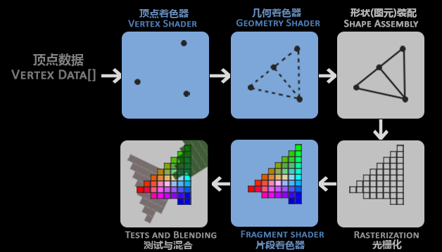

> 为了让OpenGL知道我们的坐标和颜色值构成的到底是什么，OpenGL需要你去指定这些数据所表示的渲染类型。我们是希望把这些数据渲染成一系列的点？一系列的三角形？还是仅仅是一个长长的线？做出的这些提示叫做图元(Primitive)，任何一个绘制指令的调用都将把图元传递给OpenGL。这是其中的几个：GL_POINTS、GL_TRIANGLES、GL_LINE_STRIP。

> 模板测试->深度测试

> Early-Z 是一种优化技术，它发生在顶点着色器和片元着色器之间，会提前进行深度测试，将很多无效的像素提前剔除，避免它们进入耗时的片元着色器阶段。而模板测试默认是不开启的，若开启，它是在片元着色器之后执行的，GPU 会读取模板缓冲区中该片元位置的模板值，并与参考值进行比较，以确定该片元是否通过测试。也就是说，Early-Z 在片元着色器之前起作用，而模板测试在片元着色器之后进行，所以 Early-Z 在模板测试前面。

### render pipeline 多看

图形渲染管线的第一个部分是顶点着色器(Vertex Shader)，它把一个单独的顶点作为输入。顶点着色器主要的目的是把3D坐标转为另一种3D坐标（后面会解释），同时顶点着色器允许我们对顶点属性进行一些基本处理。

顶点着色器阶段的输出可以选择性地传递给几何着色器(Geometry Shader)。几何着色器将一组顶点作为输入，这些顶点形成图元，并且能够通过发出新的顶点来形成新的(或其他)图元来生成其他形状。在这个例子中，它从给定的形状中生成第二个三角形。

图元装配(Primitive Assembly)阶段将顶点着色器（或几何着色器）输出的所有顶点作为输入（如果是GL_POINTS，那么就是一个顶点），并将所有的点装配成指定图元的形状；本节例子中是两个三角形。

图元装配阶段的输出会被传入光栅化阶段(Rasterization Stage)，这里它会把图元映射为最终屏幕上相应的像素，生成供片段着色器(Fragment Shader)使用的片段(Fragment)。在片段着色器运行之前会执行裁切(Clipping)。裁切会丢弃超出你的视图以外的所有像素，用来提升执行效率。

OpenGL中的一个片段是OpenGL渲染一个像素所需的所有数据。

片段着色器的主要目的是计算一个像素的最终颜色，这也是所有OpenGL高级效果产生的地方。通常，片段着色器包含3D场景的数据（比如光照、阴影、光的颜色等等），这些数据可以被用来计算最终像素的颜色。

在所有对应颜色值确定以后，最终的对象将会被传到最后一个阶段，我们叫做Alpha测试和混合(Blending)阶段。这个阶段检测片段的对应的深度（和模板(Stencil)）值（后面会讲），用它们来判断这个像素是其它物体的前面还是后面，决定是否应该丢弃。这个阶段也会检查alpha值（alpha值定义了一个物体的透明度）并对物体进行混合(Blend)。所以，即使在片段着色器中计算出来了一个像素输出的颜色，在渲染多个三角形的时候最后的像素颜色也可能完全不同。

可以看到，图形渲染管线非常复杂，它包含很多可配置的部分。然而，对于大多数场合，我们只需要配置顶点和片段着色器就行了。几何着色器是可选的，通常使用它默认的着色器就行了。

在现代OpenGL中，我们**必须**定义至少一个顶点着色器和一个片段着色器（因为GPU中没有默认的顶点/片段着色器）。出于这个原因，刚开始学习现代OpenGL的时候可能会非常困难，因为在你能够渲染自己的第一个三角形之前已经需要了解一大堆知识了。在本节结束你最终渲染出你的三角形的时候，你也会了解到非常多的图形编程知识。

### vertex shader

#### 顶点缓冲对象(Vertex Buffer Objects, VBO)

我们通过顶点缓冲对象(Vertex Buffer Objects, VBO)管理这个内存，它会在GPU内存（通常被称为显存）中储存大量顶点。使用这些缓冲对象的好处是我们可以一次性的发送一大批数据到显卡上，而不是每个顶点发送一次。从CPU把数据发送到显卡相对较慢，所以只要可能我们都要尝试尽量一次性发送尽可能多的数据。当数据发送至显卡的内存中后，顶点着色器几乎能立即访问顶点，这是个非常快的过程。

cpu会向gpu批量的发送数据,而不是一个顶点发送一次.cpu和gpu通信是有瓶颈的.

#### glBindBuffer/glBufferData

opengl 对象都应该有一个唯一ID.比如:

```C++
// 声明
unsigned int VBO;
glGenBuffers(1, &VBO);
// or
glBindBuffer(GL_ARRAY_BUFFER, VBO);
// 把顶点数据复制进去
glBufferData(GL_ARRAY_BUFFER, sizeof(vertices), vertices, GL_STATIC_DRAW);
```

第四个参数指定了我们希望显卡如何管理给定的数据。它有三种形式：

* GL_STATIC_DRAW ：数据不会或几乎不会改变。
* GL_DYNAMIC_DRAW：数据会被改变很多。
* GL_STREAM_DRAW ：数据每次绘制时都会改变。

三角形的位置数据不会改变，每次渲染调用时都保持原样，所以它的使用类型最好是GL_STATIC_DRAW。如果，比如说一个缓冲中的数据将频繁被改变，那么使用的类型就是GL_DYNAMIC_DRAW或GL_STREAM_DRAW，这样就能确保显卡把数据放在能够高速写入的内存部分。

#### glCreateShader/glShaderSource/glCompileShader

```C++
unsigned int vertexShader;
vertexShader = glCreateShader(GL_VERTEX_SHADER);
glShaderSource(vertexShader, 1, &vertexShaderSource, NULL);
glCompileShader(vertexShader);
```

### fragment shader

```C++
unsigned int fragmentShader;
fragmentShader = glCreateShader(GL_FRAGMENT_SHADER);
glShaderSource(fragmentShader, 1, &fragmentShaderSource, NULL);
glCompileShader(fragmentShader);
```

### 着色器程序对象(Shader Program Object)

是多个着色器合并之后并最终链接完成的版本

```C++
unsigned int shaderProgram;
shaderProgram = glCreateProgram();
glAttachShader(shaderProgram, vertexShader);
glAttachShader(shaderProgram, fragmentShader);
glLinkProgram(shaderProgram);

glGetProgramiv(shaderProgram, GL_LINK_STATUS, &success);
if(!success) {
    glGetProgramInfoLog(shaderProgram, 512, NULL, infoLog);
    ...
}

glUseProgram(shaderProgram);
glDeleteShader(vertexShader);
glDeleteShader(fragmentShader);

```

### 链接顶点属性

顶点着色器允许我们指定任何以顶点属性为形式的输入。

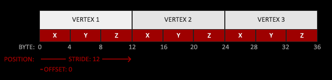

* 位置数据被储存为32位（4字节）浮点值。
* 每个位置包含3个这样的值。
* 在这3个值之间没有空隙（或其他值）。这几个值在数组中紧密排列(Tightly Packed)。
* 数据中第一个值在缓冲开始的位置。

有了这些信息我们就可以使用glVertexAttribPointer函数告诉OpenGL该如何解析顶点数据（应用到逐个顶点属性上）了：

```C++
glVertexAttribPointer(0, 3, GL_FLOAT, GL_FALSE, 3 * sizeof(float), (void*)0);
glEnableVertexAttribArray(0);
```

* 第一个参数指定我们要配置的顶点属性。还记得我们在顶点着色器中使用 `layout(location = 0)`定义了position顶点属性的位置值(Location)吗？它可以把顶点属性的位置值设置为 `0`。因为我们希望把数据传递到这一个顶点属性中，所以这里我们传入 `0`。
* 第二个参数指定顶点属性的大小。顶点属性是一个 `vec3`，它由3个值组成，所以大小是3。
* 第三个参数指定数据的类型，这里是GL_FLOAT(GLSL中 `vec*`都是由浮点数值组成的)。
* 下个参数定义我们是否希望数据被标准化(Normalize)。如果我们设置为GL_TRUE，所有数据都会被映射到0（对于有符号型signed数据是-1）到1之间。我们把它设置为GL_FALSE。
* 第五个参数叫做步长(Stride)，它告诉我们在连续的顶点属性组之间的间隔。由于下个组位置数据在3个 `float`之后，我们把步长设置为 `3 * sizeof(float)`。要注意的是由于我们知道这个数组是紧密排列的（在两个顶点属性之间没有空隙）我们也可以设置为0来让OpenGL决定具体步长是多少（只有当数值是紧密排列时才可用）。一旦我们有更多的顶点属性，我们就必须更小心地定义每个顶点属性之间的间隔，我们在后面会看到更多的例子（译注: 这个参数的意思简单说就是从这个属性第二次出现的地方到整个数组0位置之间有多少字节）。
* 最后一个参数的类型是 `void*`，所以需要我们进行这个奇怪的强制类型转换。它表示位置数据在缓冲中起始位置的偏移量(Offset)。由于位置数据在数组的开头，所以这里是0。我们会在后面详细解释这个参数。

VBO（Vertex Buffer Object，顶点缓冲对象）

> 每个顶点属性从一个VBO管理的内存中获得它的数据，而具体是从哪个VBO（程序中可以有多个VBO）获取则是通过在调用glVertexAttribPointer时绑定到GL_ARRAY_BUFFER的VBO决定的。由于在调用glVertexAttribPointer之前绑定的是先前定义的VBO对象，顶点属性 `0`现在会链接到它的顶点数据。

```C++
// 0. 复制顶点数组到缓冲中供OpenGL使用
glBindBuffer(GL_ARRAY_BUFFER, VBO);
glBufferData(GL_ARRAY_BUFFER, sizeof(vertices), vertices, GL_STATIC_DRAW);
// 1. 设置顶点属性指针
glVertexAttribPointer(0, 3, GL_FLOAT, GL_FALSE, 3 * sizeof(float), (void*)0);
glEnableVertexAttribArray(0);
// 2. 当我们渲染一个物体时要使用着色器程序
glUseProgram(shaderProgram);
// 3. 绘制物体
someOpenGLFunctionThatDrawsOurTriangle();
```

### 顶点数组对象(Vertex Array Object, VAO)

可以像顶点缓冲对象那样被绑定，任何随后的顶点属性调用都会储存在这个VAO中。这样的好处就是，当配置顶点属性指针时，你只需要将那些调用执行一次，之后再绘制物体的时候只需要绑定相应的VAO就行了。这使在不同顶点数据和属性配置之间切换变得非常简单，只需要绑定不同的VAO就行了。刚刚设置的所有状态都将存储在VAO中.

* glEnableVertexAttribArray和glDisableVertexAttribArray的调用。
* 通过glVertexAttribPointer设置的顶点属性配置。
* 通过glVertexAttribPointer调用与顶点属性关联的顶点缓冲对象。

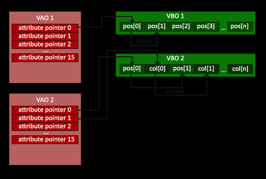

```C++
unsigned int VAO;
glGenVertexArrays(1, &VAO);

// ..:: 初始化代码（只运行一次 (除非你的物体频繁改变)） :: ..
// 1. 绑定VAO
glBindVertexArray(VAO);
// 2. 把顶点数组复制到缓冲中供OpenGL使用
glBindBuffer(GL_ARRAY_BUFFER, VBO);
glBufferData(GL_ARRAY_BUFFER, sizeof(vertices), vertices, GL_STATIC_DRAW);
// 3. 设置顶点属性指针
glVertexAttribPointer(0, 3, GL_FLOAT, GL_FALSE, 3 * sizeof(float), (void*)0);
glEnableVertexAttribArray(0);

[...]

// ..:: 绘制代码（渲染循环中） :: ..
// 4. 绘制物体
glUseProgram(shaderProgram);
glBindVertexArray(VAO);
someOpenGLFunctionThatDrawsOurTriangle(); // 比如 glDrawArrays(GL_TRIANGLES, 0, 3);

```

### 元素缓冲对象(Element Buffer Object，EBO) / 索引缓冲对象(Index Buffer Object，IBO)

 EBO是一个缓冲区，就像一个顶点缓冲区对象一样，它存储 OpenGL 用来决定要绘制哪些顶点的索引。这种所谓的索引绘制(Indexed Drawing)正是我们问题的解决方案.

```C++
float vertices[] = {
    0.5f, 0.5f, 0.0f,   // 右上角
    0.5f, -0.5f, 0.0f,  // 右下角
    -0.5f, -0.5f, 0.0f, // 左下角
    -0.5f, 0.5f, 0.0f   // 左上角
};

unsigned int indices[] = {
    // 注意索引从0开始! 
    // 此例的索引(0,1,2,3)就是顶点数组vertices的下标，
    // 这样可以由下标代表顶点组合成矩形

    0, 1, 3, // 第一个三角形
    1, 2, 3  // 第二个三角形
};

// 声明 EBO
unsigned int EBO;
glGenBuffers(1, &EBO);

// 数据复制到 EBO
glBindBuffer(GL_ELEMENT_ARRAY_BUFFER, EBO);
glBufferData(GL_ELEMENT_ARRAY_BUFFER, sizeof(indices), indices, GL_STATIC_DRAW);

// 设置绘制
glBindBuffer(GL_ELEMENT_ARRAY_BUFFER, EBO);
glDrawElements(GL_TRIANGLES, 6, GL_UNSIGNED_INT, 0);


```

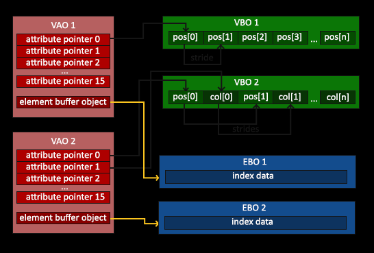

```C++
// ..:: 初始化代码 :: ..
// 1. 绑定顶点数组对象
glBindVertexArray(VAO);
// 2. 把我们的顶点数组复制到一个顶点缓冲中，供OpenGL使用
glBindBuffer(GL_ARRAY_BUFFER, VBO);
glBufferData(GL_ARRAY_BUFFER, sizeof(vertices), vertices, GL_STATIC_DRAW);
// 3. 复制我们的索引数组到一个索引缓冲中，供OpenGL使用
glBindBuffer(GL_ELEMENT_ARRAY_BUFFER, EBO);
glBufferData(GL_ELEMENT_ARRAY_BUFFER, sizeof(indices), indices, GL_STATIC_DRAW);
// 4. 设定顶点属性指针
glVertexAttribPointer(0, 3, GL_FLOAT, GL_FALSE, 3 * sizeof(float), (void*)0);
glEnableVertexAttribArray(0);

[...]

// ..:: 绘制代码（渲染循环中） :: ..
glUseProgram(shaderProgram);
glBindVertexArray(VAO);
glDrawElements(GL_TRIANGLES, 6, GL_UNSIGNED_INT, 0);
glBindVertexArray(0);


```

***当目标是GL_ELEMENT_ARRAY_BUFFER的时候，VAO会储存glBindBuffer的函数调用。这也意味着它也会储存解绑调用，所以确保你没有在解绑VAO之前解绑索引数组缓冲，否则它就没有这个EBO配置了。***

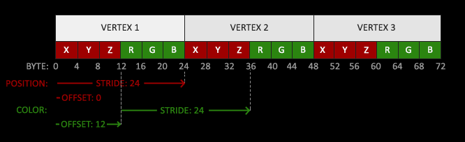

```C++
// 位置属性
glVertexAttribPointer(0, 3, GL_FLOAT, GL_FALSE, 6 * sizeof(float), (void*)0);
glEnableVertexAttribArray(0);
// 颜色属性
glVertexAttribPointer(1, 3, GL_FLOAT, GL_FALSE, 6 * sizeof(float), (void*)(3* sizeof(float)));
glEnableVertexAttribArray(1);

```

片段着色器中进行的所谓片段插值(Fragment Interpolation)的结果。当渲染一个三角形时，光栅化(Rasterization)阶段通常会造成比原指定顶点更多的片段。光栅会根据每个片段在三角形形状上所处相对位置决定这些片段的位置。
基于这些位置，它会插值(Interpolate)所有片段着色器的输入变量。比如说，我们有一个线段，上面的端点是绿色的，下面的端点是蓝色的。如果一个片段着色器在线段的70%的位置运行，它的颜色输入属性就会是一个绿色和蓝色的线性结合；更精确地说就是30%蓝 + 70%绿。

### texture

sampling

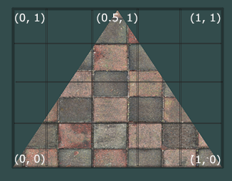

#### 纹理环绕方式

| 环绕方式           | 描述                                                                                   |
| ------------------ | -------------------------------------------------------------------------------------- |
| GL_REPEAT          | 对纹理的默认行为。重复纹理图像。                                                       |
| GL_MIRRORED_REPEAT | 和GL_REPEAT一样，但每次重复图片是镜像放置的。                                          |
| GL_CLAMP_TO_EDGE   | 纹理坐标会被约束在0到1之间，超出的部分会重复纹理坐标的边缘，产生一种边缘被拉伸的效果。 |
| GL_CLAMP_TO_BORDER | 超出的坐标为用户指定的边缘颜色。                                                       |

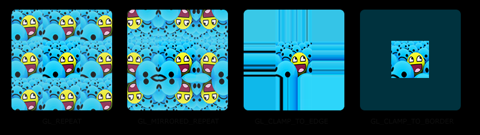

```C++
glTexParameteri(GL_TEXTURE_2D, GL_TEXTURE_WRAP_S, GL_MIRRORED_REPEAT);
glTexParameteri(GL_TEXTURE_2D, GL_TEXTURE_WRAP_T, GL_MIRRORED_REPEAT);

float borderColor[] = { 1.0f, 1.0f, 0.0f, 1.0f };
glTexParameterfv(GL_TEXTURE_2D, GL_TEXTURE_BORDER_COLOR, borderColor);
```

#### 纹理过滤

纹理坐标不依赖于分辨率(Resolution)，它可以是任意浮点值，所以OpenGL需要知道怎样将纹理像素(Texture Pixel，也叫Texel，译注1)映射到纹理坐标。当你有一个很大的物体但是纹理的分辨率很低的时候这就变得很重要了。你可能已经猜到了，OpenGL也有对于纹理过滤(Texture Filtering)的选项。纹理过滤有很多个选项，但是现在我们只讨论最重要的两种：GL_NEAREST和GL_LINEAR。

Texture Pixel也叫Texel，你可以想象你打开一张 `.jpg`格式图片，不断放大你会发现它是由无数像素点组成的，这个点就是纹理像素；注意不要和纹理坐标搞混，纹理坐标是你给模型顶点设置的那个数组，OpenGL以这个顶点的纹理坐标数据去查找纹理图像上的像素，然后进行采样提取纹理像素的颜色。

GL_NEAREST（也叫邻近过滤，Nearest Neighbor Filtering）是OpenGL默认的纹理过滤方式

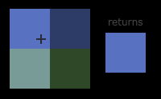

GL_LINEAR（也叫线性过滤，(Bi)linear Filtering）它会基于纹理坐标附近的纹理像素，计算出一个插值，近似出这些纹理像素之间的颜色。

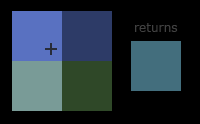


当进行放大(Magnify)和缩小(Minify)操作的时候可以设置纹理过滤的选项，比如你可以在纹理被缩小的时候使用邻近过滤，被放大时使用线性过滤。我们需要使用glTexParameter*函数为放大和缩小指定过滤方式。这段代码看起来会和纹理环绕方式的设置很相似：

```C++
glTexParameteri(GL_TEXTURE_2D, GL_TEXTURE_MIN_FILTER, GL_NEAREST);
glTexParameteri(GL_TEXTURE_2D, GL_TEXTURE_MAG_FILTER, GL_LINEAR);
```

#### 多级渐远纹理 Mipmap

它简单来说就是一系列的纹理图像，后一个纹理图像是前一个的二分之一。多级渐远纹理背后的理念很简单：距观察者的距离超过一定的阈值，OpenGL会使用不同的多级渐远纹理，即最适合物体的距离的那个。由于距离远，解析度不高也不会被用户注意到。同时，多级渐远纹理另一加分之处是它的性能非常好。让我们看一下多级渐远纹理是什么样子的：

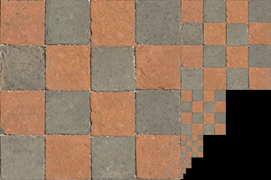

glGenerateMipmap

在渲染中切换多级渐远纹理级别(Level)时，OpenGL在两个不同级别的多级渐远纹理层之间会产生不真实的生硬边界。就像普通的纹理过滤一样，切换多级渐远纹理级别时你也可以在两个不同多级渐远纹理级别之间使用NEAREST和LINEAR过滤。为了指定不同多级渐远纹理级别之间的过滤方式，你可以使用下面四个选项中的一个代替原有的过滤方式：

| 过滤方式                  | 描述                                                                     |
| ------------------------- | ------------------------------------------------------------------------ |
| GL_NEAREST_MIPMAP_NEAREST | 使用最邻近的多级渐远纹理来匹配像素大小，并使用邻近插值进行纹理采样       |
| GL_LINEAR_MIPMAP_NEAREST  | 使用最邻近的多级渐远纹理级别，并使用线性插值进行采样                     |
| GL_NEAREST_MIPMAP_LINEAR  | 在两个最匹配像素大小的多级渐远纹理之间进行线性插值，使用邻近插值进行采样 |
| GL_LINEAR_MIPMAP_LINEAR   | 在两个邻近的多级渐远纹理之间使用线性插值，并使用线性插值进行采样         |

就像纹理过滤一样，我们可以使用glTexParameteri将过滤方式设置为前面四种提到的方法之一：

```C++
glTexParameteri(GL_TEXTURE_2D, GL_TEXTURE_MIN_FILTER, GL_LINEAR_MIPMAP_LINEAR);
glTexParameteri(GL_TEXTURE_2D, GL_TEXTURE_MAG_FILTER, GL_LINEAR);
```

##### 生成纹理

```C++
    unsigned int texture1;
    // texture 1
    // ---------
    glGenTextures(1, &texture1);
    glBindTexture(GL_TEXTURE_2D, texture1);
    // set the texture wrapping parameters
    glTexParameteri(GL_TEXTURE_2D, GL_TEXTURE_WRAP_S, GL_REPEAT);
    glTexParameteri(GL_TEXTURE_2D, GL_TEXTURE_WRAP_T, GL_REPEAT);
    // set texture filtering parameters
    glTexParameteri(GL_TEXTURE_2D, GL_TEXTURE_MIN_FILTER, GL_LINEAR);
    glTexParameteri(GL_TEXTURE_2D, GL_TEXTURE_MAG_FILTER, GL_LINEAR);
    // load image, create texture and generate mipmaps
    int width, height, nrChannels;
    stbi_set_flip_vertically_on_load(true); // tell stb_image.h to flip loaded texture's on the y-axis.
    unsigned char *data = stbi_load("resources/textures/container.jpg"), &width, &height, &nrChannels, 0);
    if (data)
    {
        glTexImage2D(GL_TEXTURE_2D, 0, GL_RGB, width, height, 0, GL_RGB, GL_UNSIGNED_BYTE, data);
        glGenerateMipmap(GL_TEXTURE_2D);
    }
    else
    {
        std::cout << "Failed to load texture" << std::endl;
    }
    stbi_image_free(data);

```

##### 应用纹理

```C++
float vertices[] = {
//     ---- 位置 ----       ---- 颜色 ----     - 纹理坐标 -
     0.5f,  0.5f, 0.0f,   1.0f, 0.0f, 0.0f,   1.0f, 1.0f,   // 右上
     0.5f, -0.5f, 0.0f,   0.0f, 1.0f, 0.0f,   1.0f, 0.0f,   // 右下
    -0.5f, -0.5f, 0.0f,   0.0f, 0.0f, 1.0f,   0.0f, 0.0f,   // 左下
    -0.5f,  0.5f, 0.0f,   1.0f, 1.0f, 0.0f,   0.0f, 1.0f    // 左上
};

```

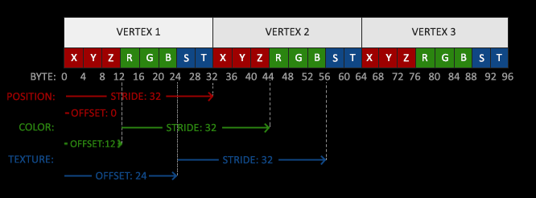

```C++
glVertexAttribPointer(2, 2, GL_FLOAT, GL_FALSE, 8 * sizeof(float), (void*)(6 * sizeof(float)));
glEnableVertexAttribArray(2);
```

uniform sampler2D ourTexture;

### Transform

点成的几何意义:

1. 计算向量夹角
2. 计算向量投影

叉乘几何意义

1. 生成垂直向量
2. 计算面积
3. 判断向量相对位置

#### 缩放

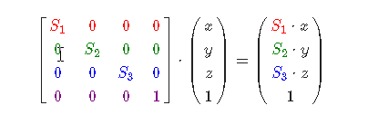

#### 位移

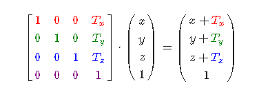

#### 旋转

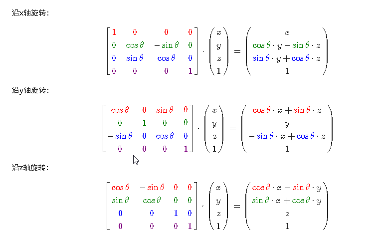

***矩阵组合不满足交换律!!!!!***

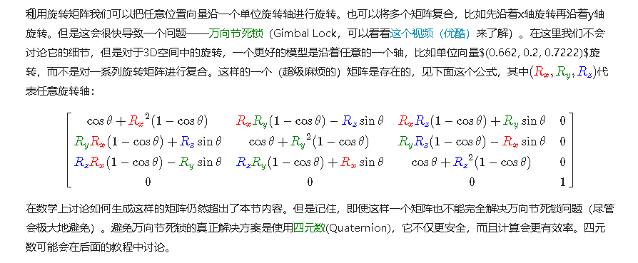

#### 四元数

你提的问题很有深度，四元数是解决三维旋转问题的重要数学工具，核心是用四个数来表示三维空间中的旋转，避免“万向锁”问题。

四元数由爱尔兰数学家威廉·罗恩·哈密顿于1843年提出，本质是一种超复数，通常记为 **q = w + xi + yj + zk**。其中w是实部，x、y、z是虚部，i、j、k是三个不同的虚数单位，且满足特定乘法规则（i² = j² = k² = -1，ij = k，ji = -k等）。

##### 四元数的核心构成与意义

1. **实部（w）**：与旋转角度相关，计算公式为 **w = cos(θ/2)**，其中θ是绕旋转轴旋转的角度。
2. **虚部（x, y, z）**：与旋转轴方向相关，计算公式为 **(x, y, z) = (nₓ·sin(θ/2), nᵧ·sin(θ/2), n_z·sin(θ/2))**，其中(nₓ, nᵧ, n_z)是旋转轴的单位向量。
3. **单位四元数**：用于表示旋转的四元数必须是单位四元数，即满足 **w² + x² + y² + z² = 1**，否则需要进行归一化处理。

---

##### 四元数的关键优势（对比欧拉角）

在三维旋转场景中，四元数主要解决了欧拉角的两大痛点：

- **避免万向锁（Gimbal Lock）**：欧拉角通过三个角度（如俯仰、偏航、滚转）描述旋转，当两个旋转轴重合时会丢失一个自由度，而四元数用四个参数描述旋转，从数学上杜绝了这一问题。
- **简化插值计算**：在动画、机器人控制等需要平滑过渡旋转的场景中，四元数的球面线性插值（Slerp）能实现更流畅的过渡，而欧拉角插值容易出现卡顿或不自然的旋转。

---

##### 四元数的主要应用场景

- **3D图形与游戏开发**：用于模型、相机的旋转计算，如Unity、Unreal Engine等引擎均内置四元数运算模块。
- **机器人与航空航天**：机械臂的姿态控制、飞行器的姿态导航，需高精度且无万向锁的旋转描述。
- **虚拟现实（VR）/增强现实（AR）**：头显设备的姿态追踪，确保虚拟场景与用户头部运动的实时、平滑同步。

四元数的应用计算核心围绕“**旋转表示**”和“**旋转操作**”展开，最常用的场景是用四元数旋转三维空间中的点，具体可拆解为明确步骤和实际案例。

#### 一、核心应用：用四元数旋转三维点

假设我们要将三维空间中的点 **P(x, y, z)**，绕单位旋转轴 **n(nₓ, nᵧ, n_z)** 旋转 **θ** 角，得到新点 **P’**，计算步骤如下：

1. **构建旋转四元数 q**根据四元数与旋转的对应关系，先确定单位四元数的四个分量：

   - 实部：**w = cos(θ/2)**
   - 虚部：**x = nₓ·sin(θ/2)，y = nᵧ·sin(θ/2)，z = n_z·sin(θ/2)**
     例如：绕z轴（n=(0,0,1)）旋转90°（θ=π/2），则 w=cos(π/4)=√2/2≈0.707，x=0，y=0，z=1·sin(π/4)=√2/2≈0.707，即 q=(0.707, 0, 0, 0.707)。
2. **将三维点 P 转化为“纯四元数 p”**纯四元数的实部为0，虚部对应点的坐标，即：**p = 0 + x_P·i + y_P·j + z_P·k**例如：点 P=(1,0,0)，对应的纯四元数 p=(0, 1, 0, 0)。
3. **计算旋转后的纯四元数 p’**核心公式为 **p’ = q · p · q⁻¹**，其中：

   - “·”表示四元数乘法（需遵循虚数单位乘法规则：i²=j²=k²=-1，ij=k，ji=-k等）；
   - **q⁻¹** 是 q 的逆四元数，由于 q 是单位四元数，其逆等于共轭，即 **q⁻¹ = (w, -x, -y, -z)**。
     沿用上例：q=(0.707,0,0,0.707)，q⁻¹=(0.707,0,0,-0.707)，p=(0,1,0,0)，计算后 p’=(0, 0, 1, 0)，对应新点 P’=(0,1,0)，符合绕z轴旋转90°的结果。
4. **从 p’ 提取旋转后的点 P’**
   忽略 p’ 的实部（旋转后实部仍为0），其虚部的x、y、z分量即为 P’ 的坐标。

#### 二、其他关键应用计算

##### 1. 四元数插值（Slerp）

用于实现两个旋转状态的平滑过渡（如动画中物体的旋转过渡），公式为：**Slerp(q₁, q₂, t) = (sin((1-t)θ)/sinθ)·q₁ + (sin(tθ)/sinθ)·q₂**其中：

- q₁、q₂ 是两个单位四元数；
- t 是插值参数（0≤t≤1），t=0时结果为q₁，t=1时结果为q₂；
- θ 是 q₁ 与 q₂ 的夹角，由点积计算：**cosθ = q₁·w·q₂·w + q₁·x·q₂·x + q₁·y·q₂·y + q₁·z·q₂·z**。

##### 2. 四元数与欧拉角的转换

满足不同场景下的格式需求，以“四元数转欧拉角（Z-Y-X顺序，即偏航-俯仰-滚转）”为例：

- 滚转角（roll）：**φ = arctan2(2(wx + yz), 1 - 2(x² + y²))**
- 俯仰角（pitch）：**θ = arcsin(2(wy - xz))**
- 偏航角（yaw）：**ψ = arctan2(2(wz + xy), 1 - 2(y² + z²))**

#### 三、实际应用注意事项

1. **必须归一化**：用于旋转的四元数必须是单位四元数，计算中若因误差导致模长偏离1，需通过“各分量除以模长”进行归一化（模长 = √(w²+x²+y²+z²)）。
2. **避免手动复杂计算**：实际开发中（如游戏、机器人控制），无需手动计算四元数乘法，Unity、Unreal Engine 或 Python 的 `numpy-quaternion` 库均提供封装好的API（如 `Quaternion.RotatePoint`）。

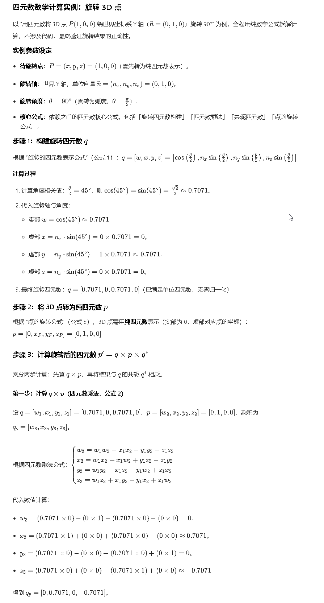

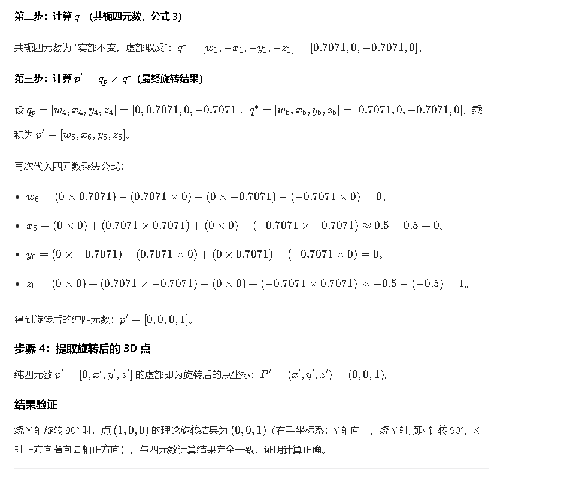

### 坐标系 Coordinate Systems

* 局部空间(Local Space，或者称为物体空间(Object Space))
* 世界空间(World Space)
* 观察空间(View Space，或者称为视觉空间(Eye Space))
* 裁剪空间(Clip Space)
* 屏幕空间(Screen Space)

为了将坐标从一个坐标系变换到另一个坐标系，我们需要用到几个变换矩阵，最重要的几个分别是模型(Model)、观察(View)、投影(Projection)三个矩阵。我们的顶点坐标起始于局部空间(Local Space)，在这里它称为局部坐标(Local Coordinate)，它在之后会变为世界坐标(World Coordinate)，观察坐标(View Coordinate)，裁剪坐标(Clip Coordinate)，并最后以屏幕坐标(Screen Coordinate)的形式结束。下面的这张图展示了整个流程以及各个变换过程做了什么：

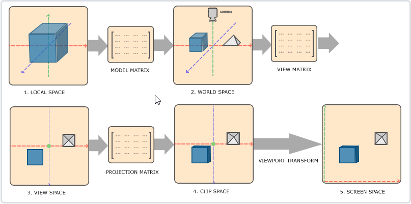

1. 局部坐标是对象相对于局部原点的坐标，也是物体起始的坐标。
2. 下一步是将局部坐标变换为世界空间坐标，世界空间坐标是处于一个更大的空间范围的。这些坐标相对于世界的全局原点，它们会和其它物体一起相对于世界的原点进行摆放。
3. 接下来我们将世界坐标变换为观察空间坐标，使得每个坐标都是从摄像机或者说观察者的角度进行观察的。
4. 坐标到达观察空间之后，我们需要将其投影到裁剪坐标。裁剪坐标会被处理至-1.0到1.0的范围内，并判断哪些顶点将会出现在屏幕上。
5. 最后，我们将裁剪坐标变换为屏幕坐标，我们将使用一个叫做视口变换(Viewport Transform)的过程。视口变换将位于-1.0到1.0范围的坐标变换到由glViewport函数所定义的坐标范围内。最后变换出来的坐标将会送到光栅器，将其转化为片段。

观察矩阵(View Matrix)

裁剪掉(Clipped)

裁剪空间(Clip Space)

裁剪体积(Clipping Volume)

**观察箱** (Viewing Box)被称为平截头体(Frustum)

投影(Projection)

透视除法(Perspective Division)

正射投影矩阵(Orthographic Projection Matrix)或一个透视投影矩阵(Perspective Projection Matrix)

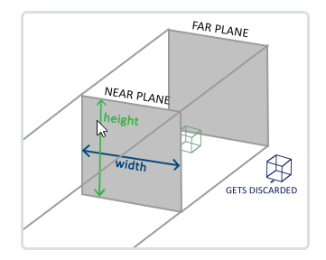

glm::ortho(0.0f, 800.0f, 0.0f, 600.0f, 0.1f, 100.0f);

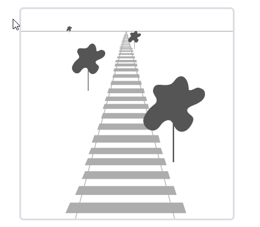

glm::mat4 proj = glm::perspective(glm::radians(45.0f), (float)width/(float)height, 0.1f, 100.0f);

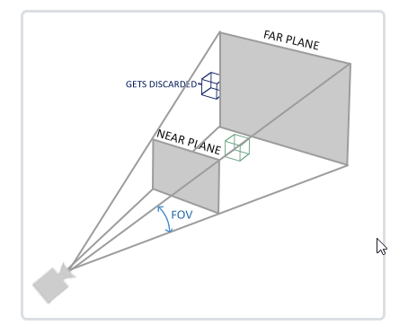

fov视野(Field of View)

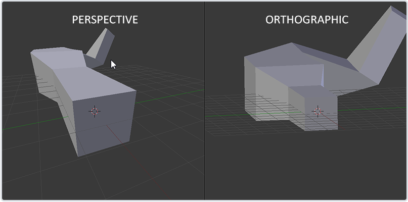

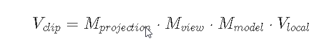

OpenGL是一个右手坐标系(Right-handed System)

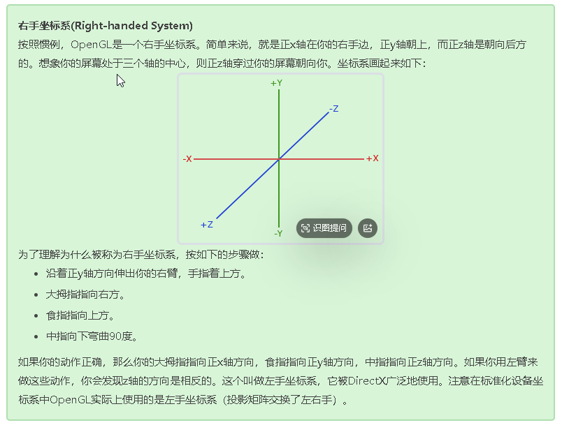

#### Z缓冲 Depth Buffer/ Z Buffer

OpenGL存储它的所有深度信息于一个Z缓冲(Z-buffer)中，也被称为深度缓冲(Depth Buffer)。GLFW会自动为你生成这样一个缓冲（就像它也有一个颜色缓冲来存储输出图像的颜色）。深度值存储在每个片段里面（作为片段的**z**值），当片段想要输出它的颜色时，OpenGL会将它的深度值和z缓冲进行比较，如果当前的片段在其它片段之后，它将会被丢弃，否则将会覆盖。这个过程称为深度测试(Depth Testing)，它是由OpenGL自动完成的。

```C++
glClear(GL_COLOR_BUFFER_BIT | GL_DEPTH_BUFFER_BIT);
```

### Camera

摄像机/观察空间(Camera/View Space)

OpenGL本身没有 **摄像机** (Camera)的概念，但我们可以通过把场景中的所有物体往相反方向移动的方式来模拟出摄像机，产生一种**我们**在移动的感觉，而不是场景在移动。

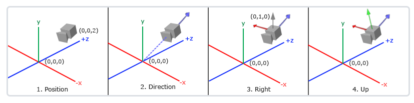

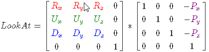

其中**R**是右向量，**U**是上向量，**D**是方向向量**P**是摄像机位置向量。注意，位置向量是相反的，因为我们最终希望把世界平移到与我们自身移动的相反方向。把这个LookAt矩阵作为观察矩阵可以很高效地把所有世界坐标变换到刚刚定义的观察空间。LookAt矩阵就像它的名字表达的那样：它会创建一个看着(Look at)给定目标的观察矩阵。

```
glm::vec3 cameraPos = glm::vec3(0.0f, 0.0f, 3.0f);
glm::vec3 cameraTarget = glm::vec3(0.0f, 0.0f, 0.0f);
glm::vec3 cameraDirection = glm::normalize(cameraPos - cameraTarget);
glm::vec3 up = glm::vec3(0.0f, 1.0f, 0.0f); 
glm::vec3 cameraRight = glm::normalize(glm::cross(up, cameraDirection));
glm::vec3 cameraUp = glm::cross(cameraDirection, cameraRight);
glm::mat4 view;
view = glm::lookAt(glm::vec3(0.0f, 0.0f, 3.0f), 
           glm::vec3(0.0f, 0.0f, 0.0f), 
           glm::vec3(0.0f, 1.0f, 0.0f));

```

```C++
void processInput(GLFWwindow *window)
{
    ...
    float cameraSpeed = 0.05f; // adjust accordingly
    if (glfwGetKey(window, GLFW_KEY_W) == GLFW_PRESS)
        cameraPos += cameraSpeed * cameraFront;
    if (glfwGetKey(window, GLFW_KEY_S) == GLFW_PRESS)
        cameraPos -= cameraSpeed * cameraFront;
    if (glfwGetKey(window, GLFW_KEY_A) == GLFW_PRESS)
        cameraPos -= glm::normalize(glm::cross(cameraFront, cameraUp)) * cameraSpeed;
    if (glfwGetKey(window, GLFW_KEY_D) == GLFW_PRESS)
        cameraPos += glm::normalize(glm::cross(cameraFront, cameraUp)) * cameraSpeed;
}
```

#### 欧拉角

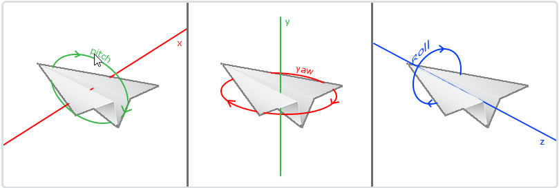

```C++
direction.x = cos(glm::radians(pitch)) * cos(glm::radians(yaw)); // 译注：direction代表摄像机的前轴(Front)，这个前轴是和本文第一幅图片的第二个摄像机的方向向量是相反的
direction.y = sin(glm::radians(pitch));
direction.z = cos(glm::radians(pitch)) * sin(glm::radians(yaw));
```

### Color

### 基础光照

#### 冯氏光照 Phong Lighting Model

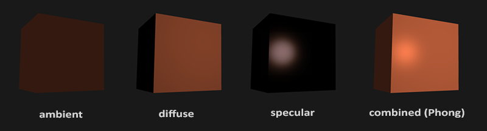

* **环境光照(Ambient Lighting)：即使在黑暗的情况下，世界上通常也仍然有一些光亮（月亮、远处的光），所以物体几乎永远不会是完全黑暗的。为了模拟这个，我们会使用一个环境光照常量，它永远会给物体一些颜色。**
* **漫反射光照(Diffuse Lighting)：模拟光源对物体的方向性影响(Directional Impact)。它是风氏光照模型中视觉上最显著的分量。物体的某一部分越是正对着光源，它就会越亮。**
* **镜面光照(Specular Lighting)：模拟有光泽物体上面出现的亮点。镜面光照的颜色相比于物体的颜色会更倾向于光的颜色。**

#### 漫反射光照

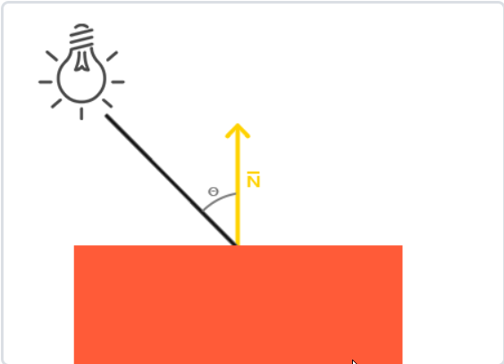

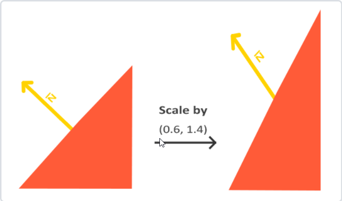

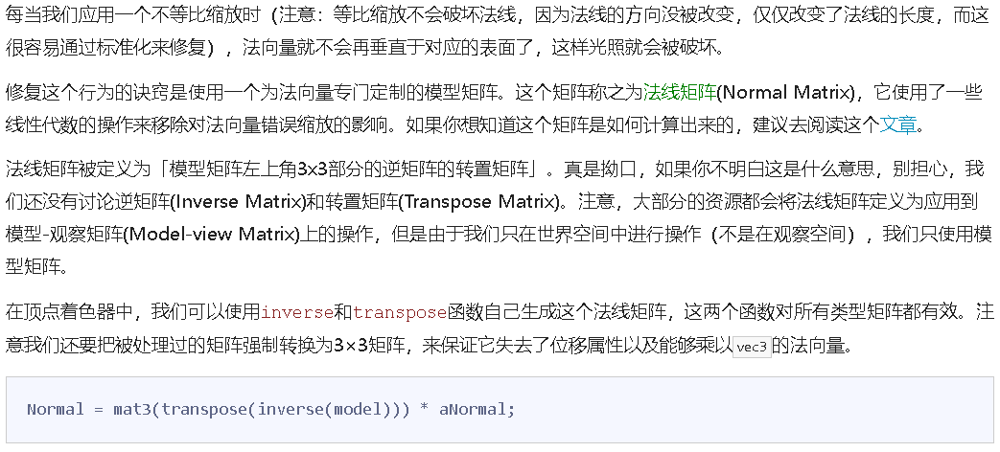

> 矩阵求逆是一项对于着色器开销很大的运算，因为它必须在场景中的每一个顶点上进行，所以应该尽可能地避免在着色器中进行求逆运算。以学习为目的的话这样做还好，但是对于一个高效的应用来说，你最好先在CPU上计算出法线矩阵，再通过uniform把它传递给着色器（就像模型矩阵一样）。

#### 镜面高光(Specular Highlight)

和漫反射光照一样，镜面光照也决定于光的方向向量和物体的法向量，但是它也决定于观察方向，例如玩家是从什么方向看向这个片段的。镜面光照决定于表面的反射特性。如果我们把物体表面设想为一面镜子，那么镜面光照最强的地方就是我们看到表面上反射光的地方。你可以在下图中看到效果：

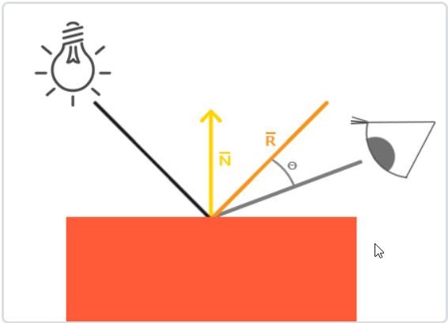

```C++
    // ambient
    float ambientStrength = 0.1;
    vec3 ambient = ambientStrength * lightColor;
  
    // diffuse 
    vec3 norm = normalize(Normal);
    vec3 lightDir = normalize(lightPos - FragPos);
    float diff = max(dot(norm, lightDir), 0.0);
    vec3 diffuse = diff * lightColor;
  
    // specular
    float specularStrength = 0.5;
    vec3 viewDir = normalize(viewPos - FragPos);
    vec3 reflectDir = reflect(-lightDir, norm);  
    float spec = pow(max(dot(viewDir, reflectDir), 0.0), 32);
    vec3 specular = specularStrength * spec * lightColor;  
  
    vec3 result = (ambient + diffuse + specular) * objectColor;
    FragColor = vec4(result, 1.0);
```

***上面这段代码主要看 diffuse和specular是怎么算的,主要是方法原理.***

### 材质

如你所见，我们为风氏光照模型的每个分量都定义一个颜色向量。ambient材质向量定义了在环境光照下这个表面反射的是什么颜色，通常与表面的颜色相同。diffuse材质向量定义了在漫反射光照下表面的颜色。漫反射颜色（和环境光照一样）也被设置为我们期望的物体颜色。specular材质向量设置的是表面上镜面高光的颜色（或者甚至可能反映一个特定表面的颜色）。最后，shininess影响镜面高光的散射/半径。

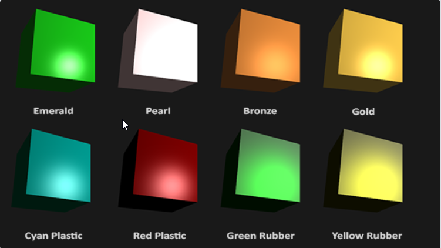

#### 光的属性

### 光照贴图

#### 漫反射贴图

漫反射贴图(Diffuse Map)（在PBR之前3D艺术家通常都这么叫它），它是一个表现了物体所有的漫反射颜色的纹理图像。

#### 镜面光贴图

#### 采样镜面光贴图

通过使用漫反射和镜面光贴图，我们可以给相对简单的物体添加大量的细节。我们甚至可以使用法线/凹凸贴图(Normal/Bump Map)或者反射贴图(Reflection Map)给物体添加更多的细节

### 投光物  Light casters

将光 **投射** (Cast)到物体的光源叫做投光物(Light Caster)

定向光(Directional Light)

点光源(Point Light)

聚光(Spotlight)

#### 平行光

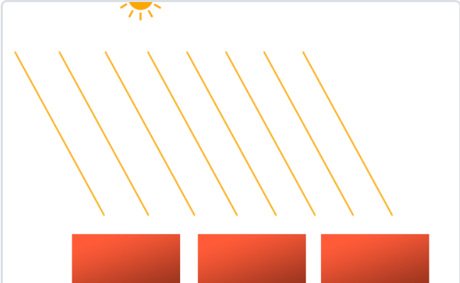

因为所有的光线都是平行的，所以物体与光源的相对位置是不重要的，因为对场景中每一个物体光的方向都是一致的。由于光的位置向量保持一致，场景中每个物体的光照计算将会是类似的。

```glsl
struct Light {
    // vec3 position; // 使用定向光就不再需要了
    vec3 direction;

    vec3 ambient;
    vec3 diffuse;
    vec3 specular;
};
```

#### 点光源(Point Light)


##### 衰减(Attenuation)

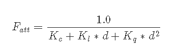

在这里**d**代表了片段距光源的距离。接下来为了计算衰减值，我们定义3个（可配置的）项：常数项**K**c、一次项**K**l和二次项**K**q。

* 常数项通常保持为1.0，它的主要作用是保证分母永远不会比1小，否则的话在某些距离上它反而会增加强度，这肯定不是我们想要的效果。
* 一次项会与距离值相乘，以线性的方式减少强度。
* 二次项会与距离的平方相乘，让光源以二次递减的方式减少强度。二次项在距离比较小的时候影响会比一次项小很多，但当距离值比较大的时候它就会比一次项更大了。

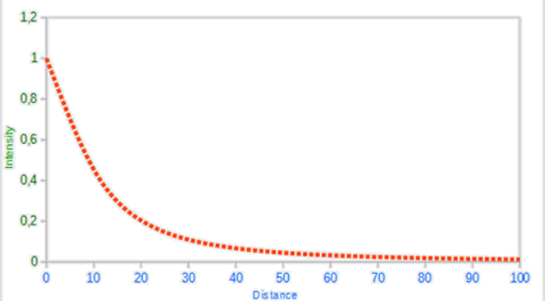

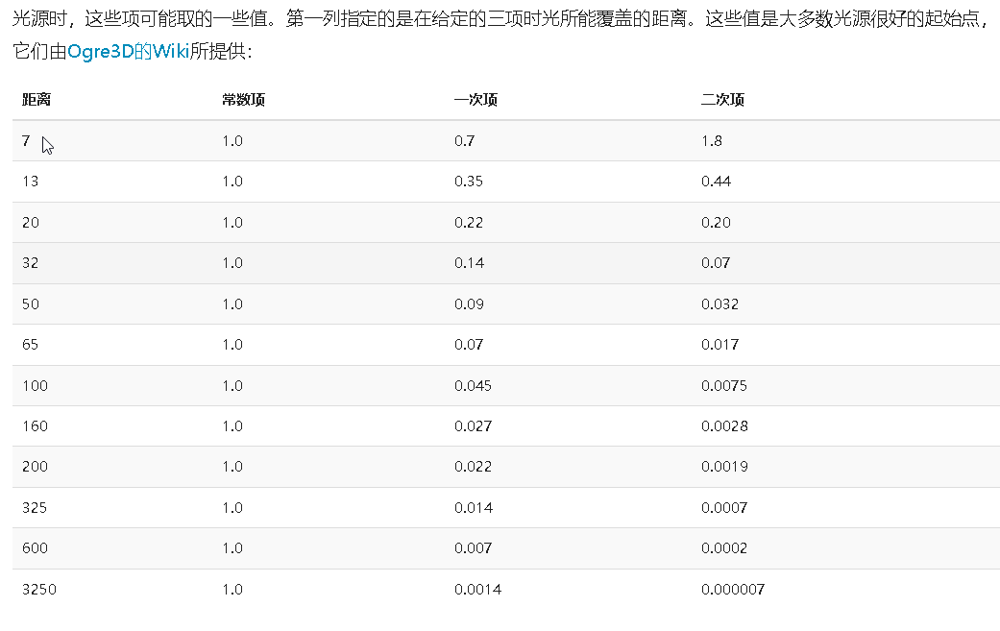

##### 实现衰减

```
struct Light {
    vec3 position;  

    vec3 ambient;
    vec3 diffuse;
    vec3 specular;

    float constant;
    float linear;
    float quadratic;
};
```

```
lightingShader.setFloat("light.constant",  1.0f);
lightingShader.setFloat("light.linear",    0.09f);
lightingShader.setFloat("light.quadratic", 0.032f);
```

#### 聚光(Spotlight)

OpenGL中聚光是用一个世界空间位置、一个方向和一个切光角(Cutoff Angle)来表示的，切光角指定了聚光的半径（译注：是圆锥的半径不是距光源距离那个半径）。对于每个片段，我们会计算片段是否位于聚光的切光方向之间（也就是在锥形内），如果是的话，我们就会相应地照亮片段。下面这张图会让你明白聚光是如何工作的：

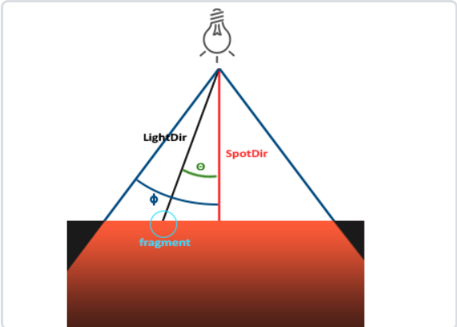

* `LightDir`：从片段指向光源的向量。
* `SpotDir`：聚光所指向的方向。
* `Phi`ϕ：指定了聚光半径的切光角。落在这个角度之外的物体都不会被这个聚光所照亮。
* `Theta`θ：LightDir向量和SpotDir向量之间的夹角。在聚光内部的话**θ**值应该比**ϕ**值小。

##### 手电筒(Flashlight)

手电筒(Flashlight)是一个位于观察者位置的聚光，通常它都会瞄准玩家视角的正前方。基本上说，手电筒就是普通的聚光，但它的位置和方向会随着玩家的位置和朝向不断更新。

所以，在片段着色器中我们需要的值有聚光的位置向量（来计算光的方向向量）、聚光的方向向量和一个切光角。我们可以将它们储存在Light结构体中：

```
struct Light {
    vec3  position;
    vec3  direction;
    float cutOff;
    ...
};
```

接下来我们将合适的值传到着色器中：

```
lightingShader.setVec3("light.position",  camera.Position);
lightingShader.setVec3("light.direction", camera.Front);
lightingShader.setFloat("light.cutOff",   glm::cos(glm::radians(12.5f)));
```

> 你可以看到，我们并没有给切光角设置一个角度值，反而是用角度值计算了一个余弦值，将余弦结果传递到片段着色器中。这样做的原因是在片段着色器中，我们会计算 `LightDir`和 `SpotDir`向量的点积，这个点积返回的将是一个余弦值而不是角度值，所以我们不能直接使用角度值和余弦值进行比较。为了获取角度值我们需要计算点积结果的反余弦，这是一个开销很大的计算。所以为了节约一点性能开销，我们将会计算切光角对应的余弦值，并将它的结果传入片段着色器中。由于这两个角度现在都由余弦角来表示了，我们可以直接对它们进行比较而不用进行任何开销高昂的计算。

> 接下来就是计算**θ**值，并将它和切光角**ϕ**对比，来决定是否在聚光的内部：

```
float theta = dot(lightDir, normalize(-light.direction));

if(theta > light.cutOff) 
{   
  // 执行光照计算
}
else  // 否则，使用环境光，让场景在聚光之外时不至于完全黑暗
  color = vec4(light.ambient * vec3(texture(material.diffuse, TexCoords)), 1.0);
```

我们首先计算了lightDir和取反的direction向量（取反的是因为我们想让向量指向光源而不是从光源出发）之间的点积。记住要对所有的相关向量标准化。

切光角(Cutoff Angle)来表示的，切光角指定了聚光的半径

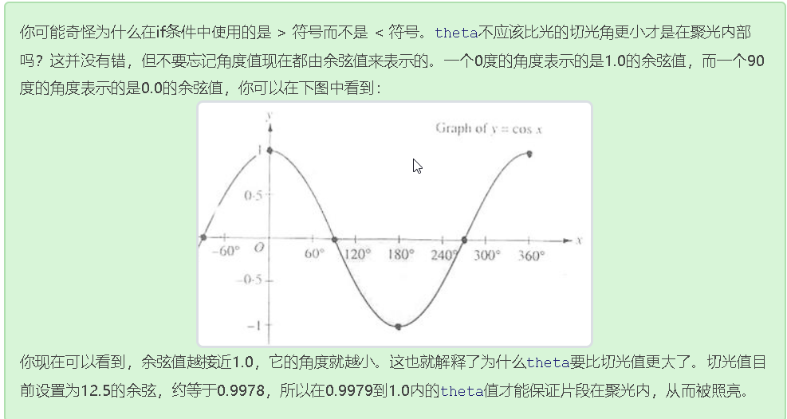

#### 平滑/软化边缘

为了创建一种看起来边缘平滑的聚光，我们需要模拟聚光有一个内圆锥(Inner Cone)和一个外圆锥(Outer Cone)。我们可以将内圆锥设置为上一部分中的那个圆锥，但我们也需要一个外圆锥，来让光从内圆锥逐渐减暗，直到外圆锥的边界

为了创建一个外圆锥，我们只需要再定义一个余弦值来代表聚光方向向量和外圆锥向量（等于它的半径）的夹角。然后，如果一个片段处于内外圆锥之间，将会给它计算出一个0.0到1.0之间的强度值。如果片段在内圆锥之内，它的强度就是1.0，如果在外圆锥之外强度值就是0.0。

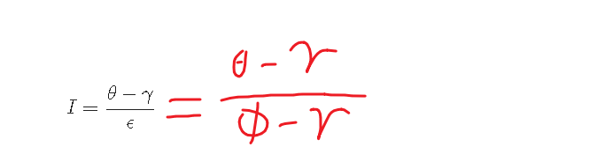

这里**ϵ**(Epsilon)是内（**ϕ**）和外圆锥（**γ**）之间的余弦值差（**ϵ**=**ϕ**−**γ**）。最终的**I**值就是在当前片段聚光的强度。

很难去表现这个公式是怎么工作的，所以我们用一些实例值来看看：

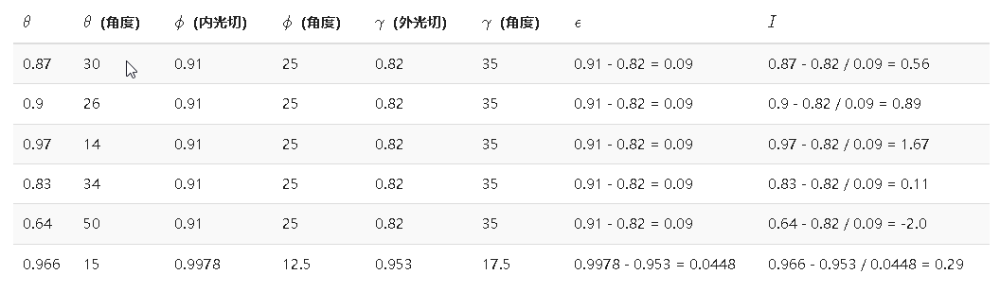

### 多光源

## 模型

### 模型加载库

Assimp(Open Asset Import Library))

当使用Assimp导入一个模型的时候，它通常会将整个模型加载进一个 **场景** (Scene)对象，它会包含导入的模型/场景中的所有数据。Assimp会将场景载入为一系列的节点(Node)，每个节点包含了场景对象中所储存数据的索引，每个节点都可以有任意数量的子节点。Assimp数据结构的（简化）模型如下：

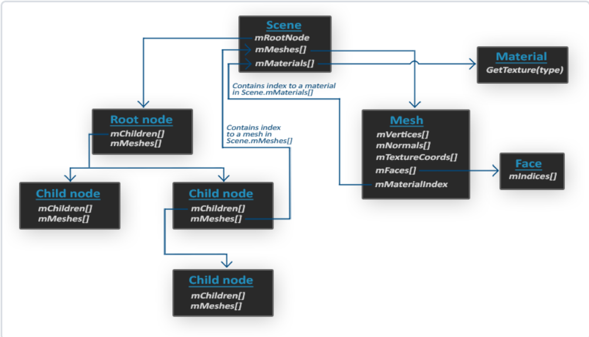

* 和材质和网格(Mesh)一样，所有的场景/模型数据都包含在Scene对象中。Scene对象也包含了场景根节点的引用。
* 场景的Root node（根节点）可能包含子节点（和其它的节点一样），它会有一系列指向场景对象中mMeshes数组中储存的网格数据的索引。Scene下的mMeshes数组储存了真正的Mesh对象，节点中的mMeshes数组保存的只是场景中网格数组的索引。
* 一个Mesh对象本身包含了渲染所需要的所有相关数据，像是顶点位置、法向量、纹理坐标、面(Face)和物体的材质。
* 一个网格包含了多个面。Face代表的是物体的渲染图元(Primitive)（三角形、方形、点）。一个面包含了组成图元的顶点的索引。由于顶点和索引是分开的，使用一个索引缓冲来渲染是非常简单的（见[你好，三角形](https://learnopengl-cn.github.io/01%20Getting%20started/04%20Hello%20Triangle/)）。
* 最后，一个网格也包含了一个Material对象，它包含了一些函数能让我们获取物体的材质属性，比如说颜色和纹理贴图（比如漫反射和镜面光贴图）。

所以，我们需要做的第一件事是将一个物体加载到Scene对象中，遍历节点，获取对应的Mesh对象（我们需要递归搜索每个节点的子节点），并处理每个Mesh对象来获取顶点数据、索引以及它的材质属性。最终的结果是一系列的网格数据，我们会将它们包含在一个 `Model`对象中。

> **网格**
>
> 当使用建模工具对物体建模的时候，艺术家通常不会用单个形状创建出整个模型。通常每个模型都由几个子模型/形状组合而成。组合模型的每个单独的形状就叫做一个网格(Mesh)。比如说有一个人形的角色：艺术家通常会将头部、四肢、衣服、武器建模为分开的组件，并将这些网格组合而成的结果表现为最终的模型。一个网格是我们在OpenGL中绘制物体所需的最小单位（顶点数据、索引和材质属性）。一个模型（通常）会包括多个网格。

#### 导入模型

Assimp很棒的一点在于，它抽象掉了加载不同文件格式的所有技术细节，只需要一行代码就能完成所有的工作：

```
Assimp::Importer importer;
const aiScene *scene = importer.ReadFile(path, aiProcess_Triangulate | aiProcess_FlipUVs);
```

我们首先声明了Assimp命名空间内的一个Importer，之后调用了它的ReadFile函数。这个函数需要一个文件路径，它的第二个参数是一些后期处理(Post-processing)的选项。除了加载文件之外，Assimp允许我们设定一些选项来强制它对导入的数据做一些额外的计算或操作。通过设定aiProcess_Triangulate，我们告诉Assimp，如果模型不是（全部）由三角形组成，它需要将模型所有的图元形状变换为三角形。aiProcess_FlipUVs将在处理的时候翻转y轴的纹理坐标（你可能还记得我们在[纹理](https://learnopengl-cn.github.io/01%20Getting%20started/06%20Textures/)教程中说过，在OpenGL中大部分的图像的y轴都是反的，所以这个后期处理选项将会修复这个）。其它一些比较有用的选项有：

* aiProcess_GenNormals：如果模型不包含法向量的话，就为每个顶点创建法线。
* aiProcess_SplitLargeMeshes：将比较大的网格分割成更小的子网格，如果你的渲染有最大顶点数限制，只能渲染较小的网格，那么它会非常有用。
* aiProcess_OptimizeMeshes：和上个选项相反，它会将多个小网格拼接为一个大的网格，减少绘制调用从而进行优化。

Assimp提供了很多有用的后期处理指令，你可以在[这里](http://assimp.sourceforge.net/lib_html/postprocess_8h.html)找到全部的指令。实际上使用Assimp加载模型是非常容易的（你也可以看到）。困难的是之后使用返回的场景对象将加载的数据转换到一个Mesh对象的数组。

完整的loadModel函数将会是这样的：

```C++
void loadModel(string path)
{
    Assimp::Importer import;
    const aiScene *scene = import.ReadFile(path, aiProcess_Triangulate | aiProcess_FlipUVs);  

    if(!scene || scene->mFlags & AI_SCENE_FLAGS_INCOMPLETE || !scene->mRootNode) 
    {
        cout << "ERROR::ASSIMP::" << import.GetErrorString() << endl;
        return;
    }
    directory = path.substr(0, path.find_last_of('/'));

    processNode(scene->mRootNode, scene);
}
```

如果什么错误都没有发生，我们希望处理场景中的所有节点，所以我们将第一个节点（根节点）传入了递归的processNode函数。因为每个节点（可能）包含有多个子节点，我们希望首先处理参数中的节点，再继续处理该节点所有的子节点，以此类推。这正符合一个递归结构，所以我们将定义一个递归函数。递归函数在做一些处理之后，使用不同的参数递归调用这个函数自身，直到某个条件被满足停止递归。在我们的例子中退出条件(Exit Condition)是所有的节点都被处理完毕。

你可能还记得Assimp的结构中，每个节点包含了一系列的网格索引，每个索引指向场景对象中的那个特定网格。我们接下来就想去获取这些网格索引，获取每个网格，处理每个网格，接着对每个节点的子节点重复这一过程。processNode函数的内容如下：

```C++
void processNode(aiNode *node, const aiScene *scene)
{
    // 处理节点所有的网格（如果有的话）
    for(unsigned int i = 0; i < node->mNumMeshes; i++)
    {
        aiMesh *mesh = scene->mMeshes[node->mMeshes[i]]; 
        meshes.push_back(processMesh(mesh, scene));   
    }
    // 接下来对它的子节点重复这一过程
    for(unsigned int i = 0; i < node->mNumChildren; i++)
    {
        processNode(node->mChildren[i], scene);
    }
}
```

我们首先检查每个节点的网格索引，并索引场景的mMeshes数组来获取对应的网格。返回的网格将会传递到processMesh函数中，它会返回一个Mesh对象，我们可以将它存储在meshes列表/vector。

所有网格都被处理之后，我们会遍历节点的所有子节点，并对它们调用相同的processMesh函数。当一个节点不再有任何子节点之后，这个函数将会停止执行。

> 认真的读者可能会发现，我们可以基本上忘掉处理任何的节点，只需要遍历场景对象的所有网格，就不需要为了索引做这一堆复杂的东西了。我们仍这么做的原因是，使用节点的最初想法是将网格之间定义一个父子关系。通过这样递归地遍历这层关系，我们就能将某个网格定义为另一个网格的父网格了。
> 这个系统的一个使用案例是，当你想位移一个汽车的网格时，你可以保证它的所有子网格（比如引擎网格、方向盘网格、轮胎网格）都会随着一起位移。这样的系统能够用父子关系很容易地创建出来。
>
> 然而，现在我们并没有使用这样一种系统，但如果你想对你的网格数据有更多的控制，通常都是建议使用这一种方法的。这种类节点的关系毕竟是由创建了这个模型的艺术家所定义。

##### 从Assimp到网格

将一个 `aiMesh`对象转化为我们自己的网格对象不是那么困难。我们要做的只是访问网格的相关属性并将它们储存到我们自己的对象中。processMesh函数的大体结构如下：

```C++
Mesh processMesh(aiMesh *mesh, const aiScene *scene)
{
    vector<Vertex> vertices;
    vector<unsigned int> indices;
    vector<Texture> textures;

    for(unsigned int i = 0; i < mesh->mNumVertices; i++)
    {
        Vertex vertex;
        // 处理顶点位置、法线和纹理坐标
        ...
        vertices.push_back(vertex);
    }
    // 处理索引
    ...
    // 处理材质
    if(mesh->mMaterialIndex >= 0)
    {
        ...
    }

    return Mesh(vertices, indices, textures);
}
```

处理网格的过程主要有三部分：获取所有的顶点数据，获取它们的网格索引，并获取相关的材质数据。处理后的数据将会储存在三个vector当中，我们会利用它们构建一个Mesh对象，并返回它到函数的调用者那里。

获取顶点数据非常简单，我们定义了一个Vertex结构体，我们将在每个迭代之后将它加到vertices数组中。我们会遍历网格中的所有顶点（使用 `mesh->mNumVertices`来获取）。在每个迭代中，我们希望使用所有的相关数据填充这个结构体。顶点的位置是这样处理的：

```C++
glm::vec3 vector; 
vector.x = mesh->mVertices[i].x;
vector.y = mesh->mVertices[i].y;
vector.z = mesh->mVertices[i].z; 
vertex.Position = vector;
```

纹理坐标的处理也大体相似，但Assimp允许一个模型在一个顶点上有最多8个不同的纹理坐标，我们不会用到那么多，我们只关心第一组纹理坐标。我们同样也想检查网格是否真的包含了纹理坐标（可能并不会一直如此）

```C++
if(mesh->mTextureCoords[0]) // 网格是否有纹理坐标？
{
    glm::vec2 vec;
    vec.x = mesh->mTextureCoords[0][i].x; 
    vec.y = mesh->mTextureCoords[0][i].y;
    vertex.TexCoords = vec;
}
else
    vertex.TexCoords = glm::vec2(0.0f, 0.0f);
```

vertex结构体现在已经填充好了需要的顶点属性，我们会在迭代的最后将它压入vertices这个vector的尾部。这个过程会对每个网格的顶点都重复一遍。

##### 索引

Assimp的接口定义了每个网格都有一个面(Face)数组，每个面代表了一个图元，在我们的例子中（由于使用了aiProcess_Triangulate选项）它总是三角形。一个面包含了多个索引，它们定义了在每个图元中，我们应该绘制哪个顶点，并以什么顺序绘制，所以如果我们遍历了所有的面，并储存了面的索引到indices这个vector中就可以了。

```C++
for(unsigned int i = 0; i < mesh->mNumFaces; i++)
{
    aiFace face = mesh->mFaces[i];
    for(unsigned int j = 0; j < face.mNumIndices; j++)
        indices.push_back(face.mIndices[j]);
}
```

所有的外部循环都结束了，我们现在有了一系列的顶点和索引数据，它们可以用来通过glDrawElements函数来绘制网格。然而，为了结束这个话题，并且对网格提供一些细节，我们还需要处理网格的材质。

##### 材质

和节点一样，一个网格只包含了一个指向材质对象的索引。如果想要获取网格真正的材质，我们还需要索引场景的mMaterials数组。网格材质索引位于它的mMaterialIndex属性中，我们同样可以用它来检测一个网格是否包含有材质：

```C++
if(mesh->mMaterialIndex >= 0)
{
    aiMaterial *material = scene->mMaterials[mesh->mMaterialIndex];
    vector<Texture> diffuseMaps = loadMaterialTextures(material, 
                                        aiTextureType_DIFFUSE, "texture_diffuse");
    textures.insert(textures.end(), diffuseMaps.begin(), diffuseMaps.end());
    vector<Texture> specularMaps = loadMaterialTextures(material, 
                                        aiTextureType_SPECULAR, "texture_specular");
    textures.insert(textures.end(), specularMaps.begin(), specularMaps.end());
}
```

我们首先从场景的mMaterials数组中获取 `aiMaterial`对象。接下来我们希望加载网格的漫反射和/或镜面光贴图。一个材质对象的内部对每种纹理类型都存储了一个纹理位置数组。不同的纹理类型都以 `aiTextureType_`为前缀。我们使用一个叫做loadMaterialTextures的工具函数来从材质中获取纹理。这个函数将会返回一个Texture结构体的vector，我们将在模型的textures vector的尾部之后存储它。

loadMaterialTextures函数遍历了给定纹理类型的所有纹理位置，获取了纹理的文件位置，并加载并和生成了纹理，将信息储存在了一个Vertex结构体中。它看起来会像这样：

```C++
vector<Texture> loadMaterialTextures(aiMaterial *mat, aiTextureType type, string typeName)
{
    vector<Texture> textures;
    for(unsigned int i = 0; i < mat->GetTextureCount(type); i++)
    {
        aiString str;
        mat->GetTexture(type, i, &str);
        Texture texture;
        texture.id = TextureFromFile(str.C_Str(), directory);
        texture.type = typeName;
        texture.path = str;
        textures.push_back(texture);
    }
    return textures;
}
```

我们首先通过GetTextureCount函数检查储存在材质中纹理的数量，这个函数需要一个纹理类型。我们会使用GetTexture获取每个纹理的文件位置，它会将结果储存在一个 `aiString`中。我们接下来使用另外一个叫做TextureFromFile的工具函数，它将会（用 `stb_image.h`）加载一个纹理并返回该纹理的ID。如果你不确定这样的代码是如何写出来的话，可以查看最后的完整代码。

> 注意，我们假设了模型文件中纹理文件的路径是相对于模型文件的本地(Local)路径，比如说与模型文件处于同一目录下。我们可以将纹理位置字符串拼接到之前（在loadModel中）获取的目录字符串上，来获取完整的纹理路径（这也是为什么GetTexture函数也需要一个目录字符串）。
>
> 在网络上找到的某些模型会对纹理位置使用绝对(Absolute)路径，这就不能在每台机器上都工作了。在这种情况下，你可能会需要手动修改这个文件，来让它对纹理使用本地路径（如果可能的话）。

#### 优化-cache

将所有加载过的纹理全局储存，每当我们想加载一个纹理的时候，首先去检查它有没有被加载过。如果有的话，我们会直接使用那个纹理，并跳过整个加载流程，来为我们省下很多处理能力。为了能够比较纹理，我们还需要储存它们的路径：

```C++
struct Texture {
    unsigned int id;
    string type;
    aiString path;  // 我们储存纹理的路径用于与其它纹理进行比较
};

vector<Texture> textures_loaded;
```

之后，在loadMaterialTextures函数中，我们希望将纹理的路径与储存在textures_loaded这个vector中的所有纹理进行比较，看看当前纹理的路径是否与其中的一个相同。如果是的话，则跳过纹理加载/生成的部分，直接使用定位到的纹理结构体为网格的纹理。更新后的函数如下：

```C++
vector<Texture> loadMaterialTextures(aiMaterial *mat, aiTextureType type, string typeName)
{
    vector<Texture> textures;
    for(unsigned int i = 0; i < mat->GetTextureCount(type); i++)
    {
        aiString str;
        mat->GetTexture(type, i, &str);
        bool skip = false;
        for(unsigned int j = 0; j < textures_loaded.size(); j++)
        {
            if(std::strcmp(textures_loaded[j].path.data(), str.C_Str()) == 0)
            {
                textures.push_back(textures_loaded[j]);
                skip = true; 
                break;
            }
        }
        if(!skip)
        {   // 如果纹理还没有被加载，则加载它
            Texture texture;
            texture.id = TextureFromFile(str.C_Str(), directory);
            texture.type = typeName;
            texture.path = str.C_Str();
            textures.push_back(texture);
            textures_loaded.push_back(texture); // 添加到已加载的纹理中
        }
    }
    return textures;
}
```

## 深度测试

深度缓冲（或z缓冲(z-buffer)）中的深度值(Depth Value)

深度缓冲就像颜色缓冲(Color Buffer)（储存所有的片段颜色：视觉输出）一样，在每个片段中储存了信息，并且（通常）和颜色缓冲有着一样的宽度和高度。深度缓冲是由窗口系统自动创建的，它会以16、24或32位float的形式储存它的深度值。在大部分的系统中，深度缓冲的精度都是24位的。

当深度测试(Depth Testing)被启用的时候，OpenGL会将一个片段的深度值与深度缓冲的内容进行对比。OpenGL会执行一个深度测试，如果这个测试通过了的话，深度缓冲将会更新为新的深度值。如果深度测试失败了，片段将会被丢弃。

深度缓冲是在片段着色器运行之后（以及模板测试(Stencil Testing)运行之后，我们将在[下一节](https://learnopengl-cn.github.io/04%20Advanced%20OpenGL/02%20Stencil%20testing/)中讨论）在屏幕空间中运行的。屏幕空间坐标与通过OpenGL的glViewport所定义的视口密切相关，并且可以直接使用GLSL内建变量gl_FragCoord从片段着色器中直接访问。gl_FragCoord的x和y分量代表了片段的屏幕空间坐标（其中(0, 0)位于左下角）。

gl_FragCoord中也包含了一个z分量，它包含了片段真正的深度值。z值就是需要与深度缓冲内容所对比的那个值。

深度缓冲是在片段着色器运行之后（以及模板测试(Stencil Testing)运行之后，我们将在[下一节](https://learnopengl-cn.github.io/04%20Advanced%20OpenGL/02%20Stencil%20testing/)中讨论）在屏幕空间中运行的。屏幕空间坐标与通过OpenGL的glViewport所定义的视口密切相关，并且可以直接使用GLSL内建变量gl_FragCoord从片段着色器中直接访问。gl_FragCoord的x和y分量代表了片段的屏幕空间坐标（其中(0, 0)位于左下角）。

gl_FragCoord中也包含了一个z分量，它包含了片段真正的深度值。z值就是需要与深度缓冲内容所对比的那个值。

> 现在大部分的GPU都提供一个叫做提前深度测试(Early Depth Testing)的硬件特性。提前深度测试允许深度测试在片段着色器之前运行。只要我们清楚一个片段永远不会是可见的（它在其他物体之后），我们就能提前丢弃这个片段。

> 片段着色器通常开销都是很大的，所以我们应该尽可能避免运行它们。当使用提前深度测试时，片段着色器的一个限制是你不能写入片段的深度值。如果一个片段着色器对它的深度值进行了写入，提前深度测试是不可能的。OpenGL不能提前知道深度值。

可以想象，在某些情况下你会需要对所有片段都执行深度测试并丢弃相应的片段，但**不**希望更新深度缓冲。基本上来说，你在使用一个只读的(Read-only)深度缓冲。OpenGL允许我们禁用深度缓冲的写入，只需要设置它的深度掩码(Depth Mask)设置为 `GL_FALSE`就可以了：

```
glEnable(GL_DEPTH_TEST); // 必须开启才行
glDepthMask(GL_FALSE);
```

#### 深度测试函数

```
glDepthFunc(GL_LESS);
```

| 函数        | 描述                                         |
| ----------- | -------------------------------------------- |
| GL_ALWAYS   | 永远通过深度测试                             |
| GL_NEVER    | 永远不通过深度测试                           |
| GL_LESS     | 在片段深度值小于缓冲的深度值时通过测试       |
| GL_EQUAL    | 在片段深度值等于缓冲区的深度值时通过测试     |
| GL_LEQUAL   | 在片段深度值小于等于缓冲区的深度值时通过测试 |
| GL_GREATER  | 在片段深度值大于缓冲区的深度值时通过测试     |
| GL_NOTEQUAL | 在片段深度值不等于缓冲区的深度值时通过测试   |
| GL_GEQUAL   | 在片段深度值大于等于缓冲区的深度值时通过测试 |

默认情况下使用的深度函数是GL_LESS，它将会丢弃深度值大于等于当前深度缓冲值的所有片段。

#### 深度值精度

观察空间的z值可能是投影平截头体的 **近平面** (Near)和 **远平面** (Far)之间的任何值。

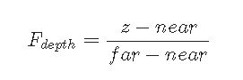

这里的**n**e**a**r和**f**a**r**值是我们之前提供给投影矩阵设置可视平截头体的（见[坐标系统](https://learnopengl-cn.github.io/01%20Getting%20started/08%20Coordinate%20Systems/)）那个 *near* 和 *far* 值。这个方程需要平截头体中的一个z值，并将它变换到了[0, 1]的范围中。z值和对应的深度值之间的关系可以在下图中看到：

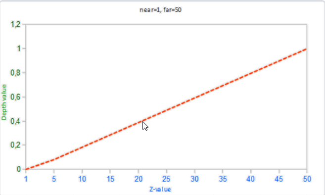

> 注意所有的方程都会将非常近的物体的深度值设置为接近0.0的值，而当物体非常接近远平面的时候，它的深度值会非常接近1.0。

然而，在实践中是几乎永远不会使用这样的线性深度缓冲(Linear Depth Buffer)的。要想有正确的投影性质，需要使用一个非线性的深度方程，它是与 1/z 成正比的。它做的就是在z值很小的时候提供非常高的精度，而在z值很远的时候提供更少的精度。花时间想想这个：我们真的需要对1000单位远的深度值和只有1单位远的充满细节的物体使用相同的精度吗？线性方程并不会考虑这一点。

由于非线性方程与 1/z 成正比，在1.0和2.0之间的z值将会变换至1.0到0.5之间的深度值，这就是一个float提供给我们的一半精度了，这在z值很小的情况下提供了非常大的精度。在50.0和100.0之间的z值将会只占2%的float精度，这正是我们所需要的。这样的一个考虑了远近距离的方程是这样的：

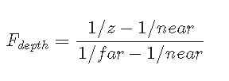

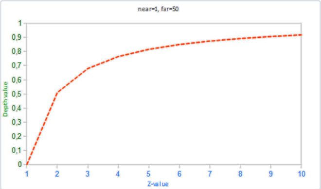

#### 深度缓冲的可视化

片段着色器中，内建gl_FragCoord向量的z值包含了那个特定片段的深度值。

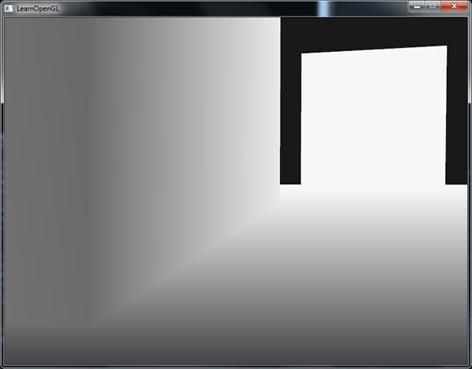

需要转换成[-1,1],然后方程2求反:

```glsl
#version 330 core
out vec4 FragColor;

float near = 0.1; 
float far  = 100.0; 

float LinearizeDepth(float depth) 
{
    float z = depth * 2.0 - 1.0; // 转换为 NDC
    return (2.0 * near * far) / (far + near - z * (far - near));  
}

void main()
{   
    float depth = LinearizeDepth(gl_FragCoord.z) / far; // 为了演示除以 far
    FragColor = vec4(vec3(depth), 1.0);
}
```

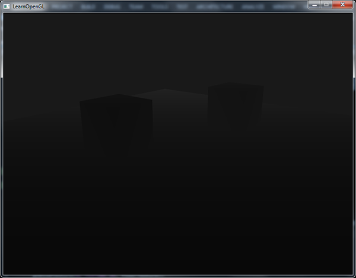

#### 深度冲突,就是闪或者重叠渲染

一个很常见的视觉错误会在两个平面或者三角形非常紧密地平行排列在一起时会发生，深度缓冲没有足够的精度来决定两个形状哪个在前面。结果就是这两个形状不断地在切换前后顺序，这会导致很奇怪的花纹。这个现象叫做深度冲突(Z-fighting)，因为它看起来像是这两个形状在争夺(Fight)谁该处于顶端。

共面的(Coplanar)

##### 防止深度冲突

第一个也是最重要的技巧是 **永远不要把多个物体摆得太靠近，以至于它们的一些三角形会重叠** 。

第二个技巧是 **尽可能将近平面设置远一些** 。因为近平面内,精度高一些

另外一个很好的技巧是牺牲一些性能， **使用更高精度的深度缓冲** 。

## 模板测试

当片段着色器处理完一个片段之后，模板测试(Stencil Test)会开始执行，和深度测试一样，它也可能会丢弃片段。接下来，被保留的片段会进入深度测试，它可能会丢弃更多的片段。

它的核心是用 “标记” 控制像素的显示 / 隐藏，实现轮廓、遮挡剔除、镜面反射等效果。

模板测试是根据又一个缓冲来进行的，它叫做模板缓冲(Stencil Buffer)，我们可以在渲染的时候更新它来获得一些很有意思的效果。

模板缓冲(Stencil Buffer)

一个模板缓冲中，（通常）每个模板值(Stencil Value)是8位的。所以每个像素/片段一共能有256种不同的模板值。我们可以将这些模板值设置为我们想要的值，然后当某一个片段有某一个模板值的时候，我们就可以选择丢弃或是保留这个片段了。

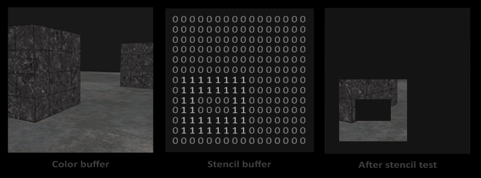

***(这样图有误导,是有绘制的地方才有buffer)***

模板缓冲首先会被清除为0，之后在模板缓冲中使用1填充了一个空心矩形。场景中的片段将会只在片段的模板值为1的时候会被渲染（其它的都被丢弃了）。

模板缓冲操作允许我们在渲染片段时将模板缓冲设定为一个特定的值。通过在渲染时修改模板缓冲的内容，我们**写入**了模板缓冲。在同一个（或者接下来的）帧中，我们可以**读取**这些值，来决定丢弃还是保留某个片段。使用模板缓冲的时候你可以尽情发挥，但大体的步骤如下：

* 启用模板缓冲的写入。
* 渲染物体，更新模板缓冲的内容。
* 禁用模板缓冲的写入。
* 渲染（其它）物体，这次根据模板缓冲的内容丢弃特定的片段。

所以，通过使用模板缓冲，我们可以根据场景中已绘制的其它物体的片段，来决定是否丢弃特定的片段。

```
glEnable(GL_STENCIL_TEST);
...
glClear(GL_COLOR_BUFFER_BIT | GL_DEPTH_BUFFER_BIT | GL_STENCIL_BUFFER_BIT);

```

#### 模板函数

glStencilFunc和glStencilOp

glStencilFunc(GLenum func, GLint ref, GLuint mask)一共包含三个参数：

* `func`：设置模板测试函数(Stencil Test Function)。这个测试函数将会应用到已储存的模板值上和glStencilFunc函数的 `ref`值上。可用的选项有：GL_NEVER、GL_LESS、GL_LEQUAL、GL_GREATER、GL_GEQUAL、GL_EQUAL、GL_NOTEQUAL和GL_ALWAYS。它们的语义和深度缓冲的函数类似。
* `ref`：设置了模板测试的参考值(Reference Value)。模板缓冲的内容将会与这个值进行比较。
* `mask`：设置一个掩码，它将会与参考值和储存的模板值在测试比较它们之前进行与(AND)运算。初始情况下所有位都为1。

```
glStencilFunc(GL_EQUAL, 1, 0xFF) // 这会告诉OpenGL，只要一个片段的模板值等于(GL_EQUAL)参考值1，片段将会通过测试并被绘制，否则会被丢弃。
```

glStencilOp(GLenum sfail, GLenum dpfail, GLenum dppass)一共包含三个选项，我们能够设定每个选项应该采取的行为：

* `sfail`：模板测试失败时采取的行为。
* `dpfail`：模板测试通过，但深度测试失败时采取的行为。
* `dppass`：模板测试和深度测试都通过时采取的行为。

| 行为         | 描述                                               |
| ------------ | -------------------------------------------------- |
| GL_KEEP      | 保持当前储存的模板值                               |
| GL_ZERO      | 将模板值设置为0                                    |
| GL_REPLACE   | 将模板值设置为glStencilFunc函数设置的 `ref`值    |
| GL_INCR      | 如果模板值小于最大值则将模板值加1                  |
| GL_INCR_WRAP | 与GL_INCR一样，但如果模板值超过了最大值则归零      |
| GL_DECR      | 如果模板值大于最小值则将模板值减1                  |
| GL_DECR_WRAP | 与GL_DECR一样，但如果模板值小于0则将其设置为最大值 |
| GL_INVERT    | 按位翻转当前的模板缓冲值                           |

#### 物体轮廓

仅仅看了前面的部分你还是不太可能能够完全理解模板测试的工作原理，所以我们将会展示一个使用模板测试就可以完成的有用特性，它叫做物体轮廓(Object Outlining)。

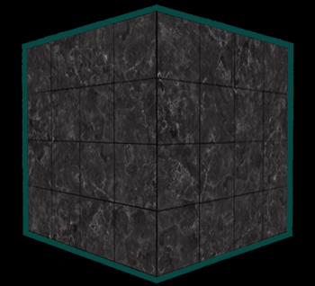

为物体创建轮廓的步骤如下：

1. 启用模板写入。
2. 在绘制（需要添加轮廓的）物体之前，将模板函数设置为GL_ALWAYS，每当物体的片段被渲染时，将模板缓冲更新为1。
3. 渲染物体。
4. 禁用模板写入以及深度测试。
5. 将每个物体缩放一点点。
6. 使用一个不同的片段着色器，输出一个单独的（边框）颜色。
7. 再次绘制物体，但只在它们片段的模板值不等于1时才绘制。
8. 再次启用模板写入和深度测试。

这个过程将每个物体的片段的模板缓冲设置为1，当我们想要绘制边框的时候，我们主要绘制放大版本的物体中模板测试通过的部分，也就是物体的边框的位置。我们主要使用模板缓冲丢弃了放大版本中属于原物体片段的部分。

```C++
glEnable(GL_DEPTH_TEST);
glStencilOp(GL_KEEP, GL_KEEP, GL_REPLACE);  

glClear(GL_COLOR_BUFFER_BIT | GL_DEPTH_BUFFER_BIT | GL_STENCIL_BUFFER_BIT); 

glStencilMask(0x00); // 记得保证我们在绘制地板的时候不会更新模板缓冲
normalShader.use();
DrawFloor()  

glStencilFunc(GL_ALWAYS, 1, 0xFF); 
glStencilMask(0xFF); 
DrawTwoContainers();

glStencilFunc(GL_NOTEQUAL, 1, 0xFF);
glStencilMask(0x00); 
glDisable(GL_DEPTH_TEST);
shaderSingleColor.use(); 
DrawTwoScaledUpContainers();
glStencilMask(0xFF);
glEnable(GL_DEPTH_TEST); 
```

重要点:

```C++
        glStencilFunc(GL_NOTEQUAL, 1, 0xFF); // 绘制区域
        glStencilMask(0x00); // 是否写入stencil buffer
```

***!!!绘制不是绘制全屏幕,而是绘制有的vao,vbo数据的地方!!!***

## 混合

混合(Blending)通常是实现物体透明度(Transparency)的一种技术\.

透明就是说一个物体（或者其中的一部分）不是纯色(Solid Color)的，它的颜色是物体本身的颜色和它背后其它物体的颜色的不同强度结合。

一个有色玻璃窗是一个透明的物体，玻璃有它自己的颜色，但它最终的颜色还包含了玻璃之后所有物体的颜色。这也是混合这一名字的出处，我们混合(Blend)（不同物体的）多种颜色为一种颜色。所以透明度能让我们看穿物体。

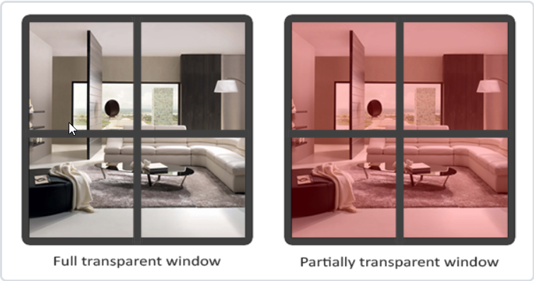

我们目前一直使用的纹理有三个颜色分量：红、绿、蓝。但一些材质会有一个内嵌的alpha通道，对每个纹素(Texel)都包含了一个alpha值。

纹素(Texel)

四边形(Quad)

丢弃(Discard)

```glsl
#version 330 core
out vec4 FragColor;

in vec2 TexCoords;

uniform sampler2D texture1;

void main()
{   
    vec4 texColor = texture(texture1, TexCoords);
    if(texColor.a < 0.1)
        discard;
    FragColor = texColor;
}
```

> 注意，当采样纹理的边缘的时候，OpenGL会对边缘的值和纹理下一个重复的值进行插值（因为我们将它的环绕方式设置为了GL_REPEAT。这通常是没问题的，但是由于我们使用了透明值，纹理图像的顶部将会与底部边缘的纯色值进行插值。这样的结果是一个半透明的有色边框，你可能会看见它环绕着你的纹理四边形。要想避免这个，每当你alpha纹理的时候，请将纹理的环绕方式设置为GL_CLAMP_TO_EDGE：
>
> ```C++
> glTexParameteri( GL_TEXTURE_2D, GL_TEXTURE_WRAP_S, GL_CLAMP_TO_EDGE);
> glTexParameteri( GL_TEXTURE_2D, GL_TEXTURE_WRAP_T, GL_CLAMP_TO_EDGE);
> ```

| GL_REPEAT          | 对纹理的默认行为。重复纹理图像。                                                       |
| ------------------ | -------------------------------------------------------------------------------------- |
| GL_MIRRORED_REPEAT | 和GL_REPEAT一样，但每次重复图片是镜像放置的。                                          |
| GL_CLAMP_TO_EDGE   | 纹理坐标会被约束在0到1之间，超出的部分会重复纹理坐标的边缘，产生一种边缘被拉伸的效果。 |
| GL_CLAMP_TO_BORDER | 超出的坐标为用户指定的边缘颜色。                                                       |

### 混合

要想渲染有多个透明度级别的图像，我们需要启用混合(Blending)。

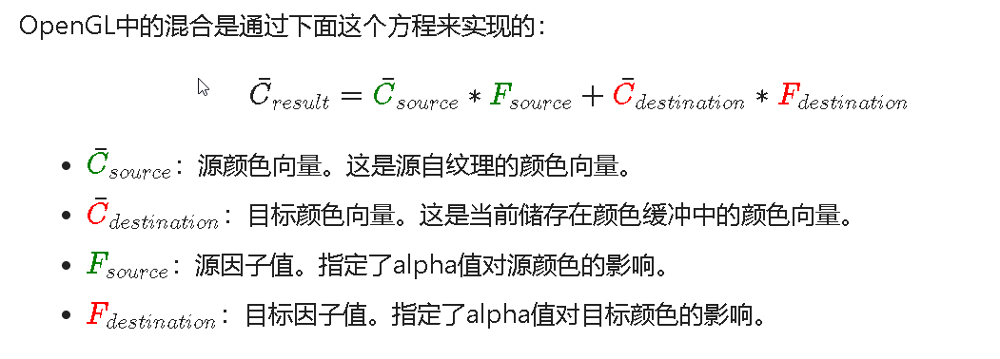

片段着色器运行完成后，并且所有的测试都通过之后，这个混合方程(Blend Equation)才会应用到片段颜色输出与当前颜色缓冲中的值（当前片段之前储存的之前片段的颜色）上。源颜色和目标颜色将会由OpenGL自动设定，但源因子和目标因子的值可以由我们来决定。我们先来看一个简单的例子：

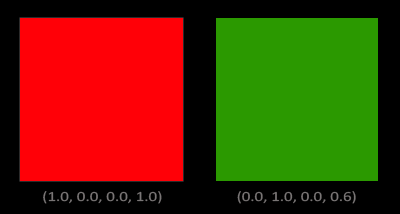

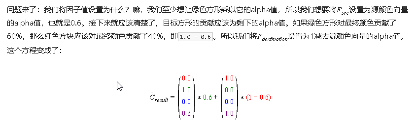

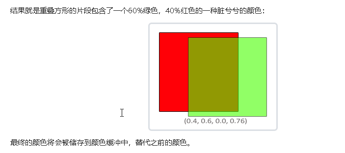

这样子很不错，但我们该如何让OpenGL使用这样的因子呢？正好有一个专门的函数，叫做glBlendFunc。

glBlendFunc(GLenum sfactor, GLenum dfactor)函数接受两个参数，来设置源和目标因子。OpenGL为我们定义了很多个选项，我们将在下面列出大部分最常用的选项。注意常数颜色向量**ˉ**C**c**o**n**s**t**a**n**t可以通过glBlendColor函数来另外设置。

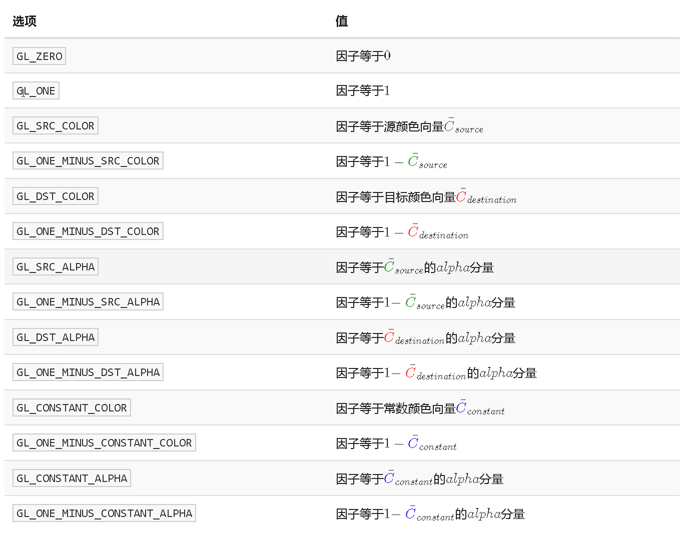

为了获得之前两个方形的混合结果，我们需要使用源颜色向量的**a**l**p**h**a**作为源因子，使用**1**−**a**l**p**h**a**作为目标因子。这将会产生以下的glBlendFunc：

glBlendFunc(GL_SRC_ALPHA, GL_ONE_MINUS_SRC_ALPHA);

也可以使用glBlendFuncSeparate为RGB和alpha通道分别设置不同的选项：

glBlendFuncSeparate(GL_SRC_ALPHA, GL_ONE_MINUS_SRC_ALPHA, GL_ONE, GL_ZERO);

***这个函数和我们之前设置的那样设置了RGB分量，但这样只能让最终的alpha分量被源颜色向量的alpha值所影响到。***

OpenGL甚至给了我们更多的灵活性，允许我们改变方程中源和目标部分的运算符。当前源和目标是相加的，但如果愿意的话，我们也可以让它们相减。glBlendEquation(GLenum mode)允许我们设置运算符，它提供了三个选项：

* GL_FUNC_ADD：默认选项，将两个分量相加：**ˉ**C**r**e**s**u**l**t**=**S**r**c**+**D**s**t。
* GL_FUNC_SUBTRACT：将两个分量相减： **ˉ**C**r**e**s**u**l**t**=**S**r**c**−**D**s**t。
* GL_FUNC_REVERSE_SUBTRACT：将两个分量相减，但顺序相反：**ˉ**C**r**e**s**u**l**t**=**D**s**t**−**S**r**c。
* GL_MIN：取两个分量中的最小值：**ˉ**C**r**e**s**u**l**t**=**m**i**n**(**D**s**t**,**S**r**c**)**。
* GL_MAX：取两个分量中的最大值：**ˉ**C**r**e**s**u**l**t**=**m**a**x**(**D**s**t**,**S**r**c**)**。

通常我们都可以省略调用glBlendEquation，因为GL_FUNC_ADD对大部分的操作来说都是我们希望的混合方程，但如果你真的想打破主流，其它的方程也可能符合你的要求。

#### 渲染半透明纹理

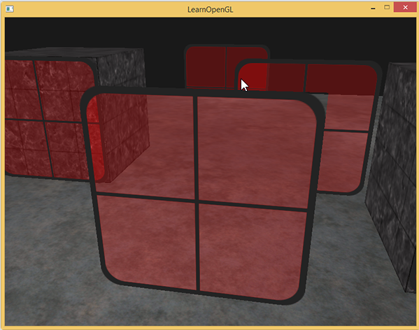

最前面窗户的透明部分遮蔽了背后的窗户？这为什么会发生呢？

发生这一现象的原因是，深度测试和混合一起使用的话会产生一些麻烦。当写入深度缓冲时，深度缓冲不会检查片段是否是透明的，所以透明的部分会和其它值一样写入到深度缓冲中。结果就是窗户的整个四边形不论透明度都会进行深度测试。即使透明的部分应该显示背后的窗户，深度测试仍然丢弃了它们。

所以我们不能随意地决定如何渲染窗户，让深度缓冲解决所有的问题了。这也是混合变得有些麻烦的部分。要想保证窗户中能够显示它们背后的窗户，我们需要首先绘制背后的这部分窗户。这也就是说在绘制的时候，我们必须先手动将窗户按照最远到最近来排序，再按照顺序渲染。

> 注意，对于草这种全透明的物体，我们可以选择丢弃透明的片段而不是混合它们，这样就解决了这些头疼的问题（没有深度问题）。

##### 不要打乱顺序

当绘制一个有不透明和透明物体的场景的时候，大体的原则如下：

1. 先绘制所有不透明的物体。
2. 对所有透明的物体排序。
3. 按顺序绘制所有透明的物体。

排序透明物体的一种方法是，从观察者视角获取物体的距离。这可以通过计算摄像机位置向量和物体的位置向量之间的距离所获得。接下来我们把距离和它对应的位置向量存储到一个STL库的map数据结构中。map会自动根据键值(Key)对它的值排序，所以只要我们添加了所有的位置，并以它的距离作为键，它们就会自动根据距离值排序了。

```C++

std::map<float, glm::vec3> sorted;
for (unsignedint i = 0; i < windows.size(); i++)
{
    float distance = glm::length(camera.Position - windows[i]);
    sorted[distance] = windows[i];
}
...
// render
for(std::map<float,glm::vec3>::reverse_iterator it = sorted.rbegin(); it != sorted.rend(); ++it) 
{
    model = glm::mat4();
    model = glm::translate(model, it->second);  
    shader.setMat4("model", model);
    glDrawArrays(GL_TRIANGLES, 0, 6);
}
```

**`std::map` 的特性** ：`std::map` 是 C++ 标准库中的关联容器，其底层通常基于**红黑树**实现，会 **自动根据键（key）的值进行排序** ，默认按 **升序** （从小到大）排列。

> 虽然按照距离排序物体这种方法对我们这个场景能够正常工作，但它并没有考虑旋转、缩放或者其它的变换，奇怪形状的物体需要一个不同的计量，而不是仅仅一个位置向量。
>
> 在场景中排序物体是一个很困难的技术，很大程度上由你场景的类型所决定，更别说它额外需要消耗的处理能力了。完整渲染一个包含不透明和透明物体的场景并不是那么容易。更高级的技术还有次序无关透明度(Order Independent Transparency, OIT)，但这超出本教程的范围了。现在，你还是必须要普通地混合你的物体，但如果你很小心，并且知道目前方法的限制的话，你仍然能够获得一个比较不错的混合实现。

## 面剔除 Face Culling

原理:

尝试在脑子中想象一个3D立方体，数数你从任意方向最多能同时看到几个面。如果你的想象力不是过于丰富了，你应该能得出最大的面数是3。你可以从任意位置和任意方向看向这个球体，但你永远不能看到3个以上的面。所以我们为什么要浪费时间绘制我们不能看见的那3个面呢？如果我们能够以某种方式丢弃这几个看不见的面，我们能省下超过50%的片段着色器执行数！

> 我说的是**超过**50%而不是50%，因为从特定角度来看的话只能看见2个甚至是1个面。在这种情况下，我们就能省下超过50%了。

面剔除(Face Culling)

面向(Front Facing)

背向(Back Facing)

环绕顺序(Winding Order)

### 环绕顺序

顺时针(Clockwise)

逆时针(Counter-clockwise)

右手

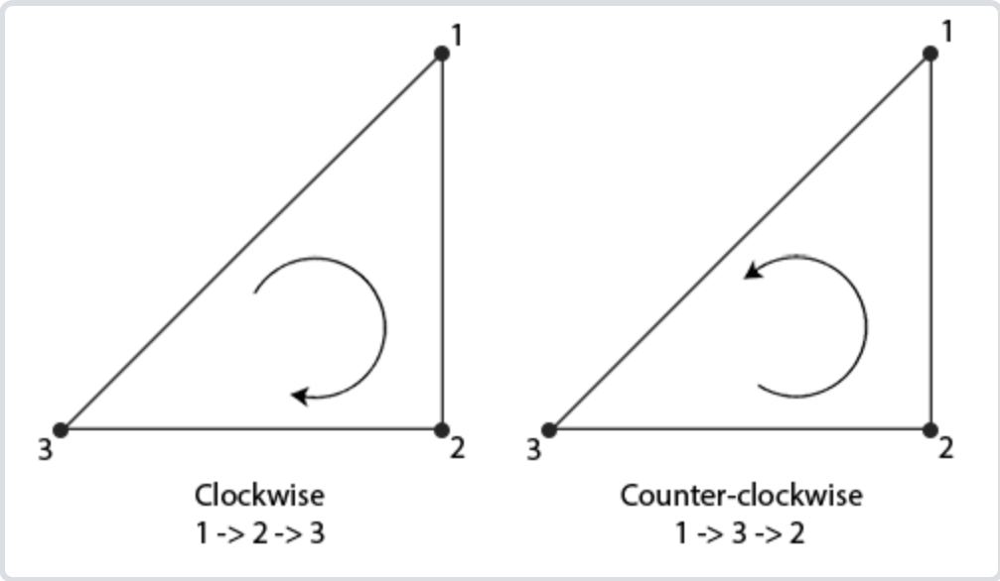

```C++
float vertices[] = {
    // 顺时针
    vertices[0], // 顶点1
    vertices[1], // 顶点2
    vertices[2], // 顶点3
    // 逆时针
    vertices[0], // 顶点1
    vertices[2], // 顶点3
    vertices[1]  // 顶点2  
};
```

实际的环绕顺序是在光栅化阶段进行的，也就是顶点着色器运行之后。这些顶点就是从**观察者视角**所见的了。

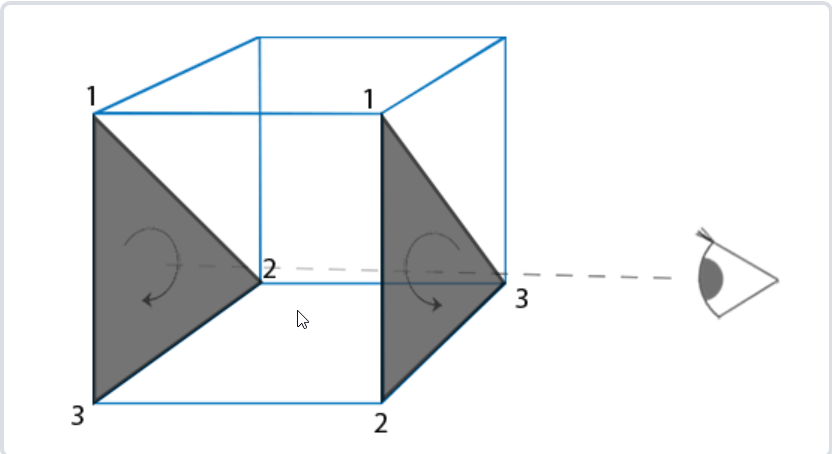

### 面剔除

glEnable(GL_CULL_FACE);

glCullFace(GL_FRONT);// 剔除面设置 (GL_FRONT,剔除正面)

glCullFace函数有三个可用的选项：

* `GL_BACK`：只剔除背向面。
* `GL_FRONT`：只剔除正向面。
* `GL_FRONT_AND_BACK`：剔除正向面和背向面。

注意这只对像立方体这样的封闭形状有效。当我们想要绘制上一节中的草时，我们必须要再次禁用面剔除，因为它们的正向面和背向面都应该是可见的。

glCullFace的初始值是GL_BACK。除了需要剔除的面之外，我们也可以通过调用glFrontFace，告诉OpenGL我们希望将顺时针的面（而不是逆时针的面）定义为正向面：

glFrontFace(GL_CCW);

默认值是GL_CCW，它代表的是逆时针的环绕顺序，另一个选项是GL_CW，它（显然）代表的是顺时针顺序。

```
glEnable(GL_CULL_FACE);
glCullFace(GL_BACK);
glFrontFace(GL_CW);
// 同样效果
glEnable(GL_CULL_FACE);
glCullFace(GL_FRONT);
```

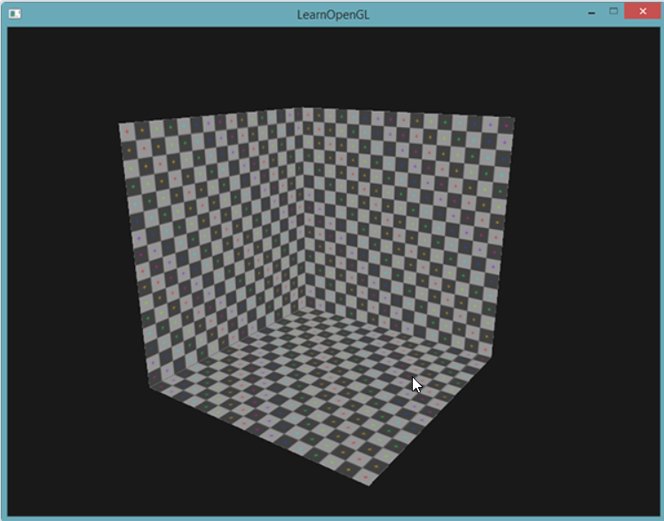

### opengl是如何判断点的环绕方向的

#### **1.将 3D 顶点投影到屏幕空间（2D）**

OpenGL 会先对三角面的 3D 顶点（`v0, v1, v2`）执行完整的坐标变换（模型、视图、投影矩阵变换），最终得到 **屏幕坐标** （2D 坐标，即像素位置，如 `(x0,y0), (x1,y1), (x2,y2)`）。

所以在光栅化时判断是最方便的!!!

#### 2.**计算 2D 顶点的 “方向值”（判断 CW/CCW）**

对于投影后的 2D 顶点 `(x0,y0), (x1,y1), (x2,y2)`，OpenGL 通过以下公式计算一个 “方向值”，用于判断环绕方向：

// 计算方向值（基于三角形面积的 2 倍，符号表示方向）
float value = (x1 - x0) * (y2 - y0) - (y1 - y0) * (x2 - x0);

#### 3.**结合 `glFrontFace` 规则判断正反面**

OpenGL 会将上述计算的环绕方向（CW/CCW）与 `glFrontFace` 设定的 “正面规则” 对比：

* 若 `glFrontFace(GL_CCW)`（默认）：当方向值 `value > 0`（CCW）时，判定为 **正面** ；否则为背面。
* 若 `glFrontFace(GL_CW)`：当方向值 `value < 0`（CW）时，判定为 **正面** ；否则为背面。

### 另外的方法

用 shoelace algorithm 思路：vertex shader 之后直接用该算法对三个点计算面积，如果面积为负数则是在 back 剔除。算法非常简单：

## 帧缓冲

屏幕缓冲:

用于写入颜色值的颜色缓冲、用于写入深度信息的深度缓冲和允许我们根据一些条件丢弃特定片段的模板缓冲。这些缓冲结合起来叫做帧缓冲(Framebuffer)，它被储存在GPU内存中的某处。

OpenGL允许我们定义我们自己的帧缓冲，也就是说我们能够定义我们自己的颜色缓冲，甚至是深度缓冲和模板缓冲。

### 创建一个帧缓冲

帧缓冲对象(Framebuffer Object, FBO)

unsignedint fbo;
glGenFramebuffers(1, &fbo);

glBindFramebuffer(GL_FRAMEBUFFER, fbo);

在绑定到GL_FRAMEBUFFER目标之后，所有的**读取**和**写入**帧缓冲的操作将会影响当前绑定的帧缓冲。我们也可以使用GL_READ_FRAMEBUFFER或GL_DRAW_FRAMEBUFFER，将一个帧缓冲分别绑定到读取目标或写入目标。绑定到GL_READ_FRAMEBUFFER的帧缓冲将会使用在所有像是glReadPixels的读取操作中，而绑定到GL_DRAW_FRAMEBUFFER的帧缓冲将会被用作渲染、清除等写入操作的目标。大部分情况你都不需要区分它们，通常都会使用GL_FRAMEBUFFER，绑定到两个上。

不幸的是，我们现在还不能使用我们的帧缓冲，因为它还不完整(Complete)，一个完整的帧缓冲需要满足以下的条件：

* 附加至少一个缓冲（颜色、深度或模板缓冲）。
* 至少有一个颜色附件(Attachment)。
* 所有的附件都必须是完整的（保留了内存）。
* 每个缓冲都应该有相同的样本数(sample)。

```C++
if(glCheckFramebufferStatus(GL_FRAMEBUFFER) == GL_FRAMEBUFFER_COMPLETE) // 检查帧缓冲是否完整
```

由于我们的帧缓冲不是默认帧缓冲，渲染指令将不会对窗口的视觉输出有任何影响。出于这个原因，渲染到一个不同的帧缓冲被叫做离屏渲染(Off-screen Rendering)。要保证所有的渲染操作在主窗口中有视觉效果，我们需要再次激活默认帧缓冲，将它绑定到 `0`

```C++
glBindFramebuffer(GL_FRAMEBUFFER, 0);
...
glDeleteFramebuffers(1, &fbo); // 在完成所有的帧缓冲操作之后，不要忘记删除这个帧缓冲对象
```

在完整性检查执行之前，我们需要给帧缓冲附加一个附件。附件是一个内存位置，它能够作为帧缓冲的一个缓冲，可以将它想象为一个图像。当创建一个附件的时候我们有两个选项：纹理或渲染缓冲对象(Renderbuffer Object)。

### 纹理附件

当把一个纹理附加到帧缓冲的时候，所有的渲染指令将会写入到这个纹理中，就像它是一个普通的颜色/深度或模板缓冲一样。使用纹理的优点是，所有渲染操作的结果将会被储存在一个纹理图像中，我们之后可以在着色器中很方便地使用它。

为帧缓冲创建一个纹理和创建一个普通的纹理差不多：

```C++
unsigned int texture;
glGenTextures(1, &texture);
glBindTexture(GL_TEXTURE_2D, texture);

glTexImage2D(GL_TEXTURE_2D, 0, GL_RGB, 800, 600, 0, GL_RGB, GL_UNSIGNED_BYTE, NULL);

glTexParameteri(GL_TEXTURE_2D, GL_TEXTURE_MIN_FILTER, GL_LINEAR);
glTexParameteri(GL_TEXTURE_2D, GL_TEXTURE_MAG_FILTER, GL_LINEAR);
```

主要的区别就是，我们将维度设置为了屏幕大小（尽管这不是必须的），并且我们给纹理的 `data`参数传递了 `NULL`。对于这个纹理，我们仅仅分配了内存而没有填充它。填充这个纹理将会在我们渲染到帧缓冲之后来进行。同样注意我们并不关心环绕方式或多级渐远纹理，我们在大多数情况下都不会需要它们。

> 如果你想将你的屏幕渲染到一个更小或更大的纹理上，你需要（在渲染到你的帧缓冲之前）再次调用glViewport，使用纹理的新维度作为参数，否则只有一小部分的纹理或屏幕会被渲染到这个纹理上。

glFrameBufferTexture2D有以下的参数：

* `target`：帧缓冲的目标（绘制、读取或者两者皆有）
* `attachment`：我们想要附加的附件类型。当前我们正在附加一个颜色附件。注意最后的 `0`意味着我们可以附加多个颜色附件。我们将在之后的教程中提到。
* `textarget`：你希望附加的纹理类型
* `texture`：要附加的纹理本身
* `level`：多级渐远纹理的级别。我们将它保留为0。

除了颜色附件之外，我们还可以附加一个深度和模板缓冲纹理到帧缓冲对象中。要附加深度缓冲的话，我们将附件类型设置为GL_DEPTH_ATTACHMENT。注意纹理的格式(Format)和内部格式(Internalformat)类型将变为GL_DEPTH_COMPONENT，来反映深度缓冲的储存格式。要附加模板缓冲的话，你要将第二个参数设置为GL_STENCIL_ATTACHMENT，并将纹理的格式设定为GL_STENCIL_INDEX。

也可以将深度缓冲和模板缓冲附加为一个单独的纹理。纹理的每32位数值将包含24位的深度信息和8位的模板信息。要将深度和模板缓冲附加为一个纹理的话，我们使用GL_DEPTH_STENCIL_ATTACHMENT类型，并配置纹理的格式，让它包含合并的深度和模板值。将一个深度和模板缓冲附加为一个纹理到帧缓冲的例子可以在下面找到：

```C++
glTexImage2D(
  GL_TEXTURE_2D, 0, GL_DEPTH24_STENCIL8, 800, 600, 0, 
  GL_DEPTH_STENCIL, GL_UNSIGNED_INT_24_8, NULL
);

glFramebufferTexture2D(GL_FRAMEBUFFER, GL_DEPTH_STENCIL_ATTACHMENT, GL_TEXTURE_2D, texture, 0);
```

### 渲染缓冲对象附件

渲染缓冲对象(Renderbuffer Object)是在纹理之后引入到OpenGL中，作为一个可用的帧缓冲附件类型的，所以在过去纹理是唯一可用的附件。和纹理图像一样，渲染缓冲对象是一个真正的缓冲，即一系列的字节、整数、像素等。渲染缓冲对象附加的好处是，它会将数据储存为OpenGL原生的渲染格式，它是为离屏渲染到帧缓冲优化过的。

渲染缓冲对象直接将所有的渲染数据储存到它的缓冲中，不会做任何针对纹理格式的转换，让它变为一个更快的可写储存介质。然而，渲染缓冲对象通常都是只写的，所以你不能读取它们（比如使用纹理访问）。当然你仍然还是能够使用glReadPixels来读取它，这会从当前绑定的帧缓冲，而不是附件本身，中返回特定区域的像素。

因为它的数据已经是原生的格式了，当写入或者复制它的数据到其它缓冲中时是非常快的。所以，交换缓冲这样的操作在使用渲染缓冲对象时会非常快。我们在每个渲染迭代最后使用的glfwSwapBuffers，也可以通过渲染缓冲对象实现：只需要写入一个渲染缓冲图像，并在最后交换到另外一个渲染缓冲就可以了。渲染缓冲对象对这种操作非常完美。

由于渲染缓冲对象通常都是只写的，它们会经常用于深度和模板附件，因为大部分时间我们都不需要从深度和模板缓冲中读取值，只关心深度和模板测试。我们**需要**深度和模板值用于测试，但不需要对它们进行 **采样** ，所以渲染缓冲对象非常适合它们。当我们不需要从这些缓冲中采样的时候，通常都会选择渲染缓冲对象，因为它会更优化一点。

```
unsigned int rbo;
glGenRenderbuffers(1, &rbo);
glBindRenderbuffer(GL_RENDERBUFFER, rbo);

//
glRenderbufferStorage(GL_RENDERBUFFER, GL_DEPTH24_STENCIL8, 800, 600); //创建深度和模板缓冲对象

glFramebufferRenderbuffer(GL_FRAMEBUFFER, GL_DEPTH_STENCIL_ATTACHMENT, GL_RENDERBUFFER, rbo);
```

通用数据缓冲(General Purpose Data Buffer)

Creating a renderbuffer object is similar to texture objects, the difference being that this object is specifically designed to be used as a framebuffer attachment, instead of a general purpose data buffer like a texture. Here we've chosen GL_DEPTH24_STENCIL8 as the internal format, which holds both the depth and stencil buffer with 24 and 8 bits respectively.

这段话核心是明确 OpenGL 中**渲染缓冲对象（Renderbuffer Object）** 与**纹理附件（Texture Attachment）** 在离屏渲染中的使用场景区分，核心逻辑围绕“是否需要采样缓冲数据”展开，具体解析如下：

1. **核心前提**：二者都是帧缓冲（Framebuffer）的有效附件，用于存储离屏渲染的像素数据（如颜色、深度、模板信息），但设计初衷和效率侧重不同。
2. **Renderbuffer 的优势与适用场景**：

   - 优势：作为“写优化”的缓冲，数据以 GPU 原生格式存储，无需转换为纹理特定格式，因此**写入速度更快**，且 OpenGL 可对其做内存优化（如减少不必要的读写开销）。
   - 适用场景：当你**不需要从缓冲中读取/采样数据**时——典型例子是深度缓冲、模板缓冲：这类缓冲仅用于渲染时的深度测试、模板测试（只需“写入”数据供 GPU 内部判断），无需在着色器中采样其数值（如不会用它当纹理贴到模型上），用 Renderbuffer 更高效。
3. **纹理附件的适用场景**：

   - 核心价值：缓冲数据会被存储为纹理格式，支持在后续渲染中（如着色器里）**采样数据**（比如把离屏渲染的结果当纹理贴到全屏四边形上，实现后处理）。
   - 适用场景：当你需要读取缓冲中的数据时——比如颜色缓冲（后处理需采样像素颜色）、需要在着色器中获取深度值（如实现景深效果），此时必须用纹理附件，因为 Renderbuffer 不支持直接采样。
4. **总结规则**：

   - 选 Renderbuffer：仅需“写入数据供 GPU 内部使用”，无需采样（如深度/模板缓冲）；
   - 选纹理附件：需“后续采样数据”（如颜色缓冲用于后处理、深度缓冲用于着色器计算）。

### 渲染到纹理 Rendering to a texture

```C++

// 创建一个帧缓冲对象
unsigned int framebuffer;
glGenFramebuffers(1, &framebuffer);
glBindFramebuffer(GL_FRAMEBUFFER, framebuffer);

...

// 生成纹理
unsigned int texColorBuffer;
glGenTextures(1, &texColorBuffer);
glBindTexture(GL_TEXTURE_2D, texColorBuffer);
glTexImage2D(GL_TEXTURE_2D, 0, GL_RGB, 800, 600, 0, GL_RGB, GL_UNSIGNED_BYTE, NULL);
glTexParameteri(GL_TEXTURE_2D, GL_TEXTURE_MIN_FILTER, GL_LINEAR );
glTexParameteri(GL_TEXTURE_2D, GL_TEXTURE_MAG_FILTER, GL_LINEAR);
glBindTexture(GL_TEXTURE_2D, 0);

// 将它附加到当前绑定的帧缓冲对象
glFramebufferTexture2D(GL_FRAMEBUFFER, GL_COLOR_ATTACHMENT0, GL_TEXTURE_2D, texColorBuffer, 0); 

// 创建一个渲染缓冲对象
unsigned int rbo;
glGenRenderbuffers(1, &rbo);
glBindRenderbuffer(GL_RENDERBUFFER, rbo); 
glRenderbufferStorage(GL_RENDERBUFFER, GL_DEPTH24_STENCIL8, 800, 600);  
glBindRenderbuffer(GL_RENDERBUFFER, 0);

// 将渲染缓冲对象附加到帧缓冲的深度和模板附件上：
glFramebufferRenderbuffer(GL_FRAMEBUFFER, GL_DEPTH_STENCIL_ATTACHMENT, GL_RENDERBUFFER, rbo);

// 检查帧缓冲是否是完整的，如果不是，我们将打印错误信息
if(glCheckFramebufferStatus(GL_FRAMEBUFFER) != GL_FRAMEBUFFER_COMPLETE)
    std::cout << "ERROR::FRAMEBUFFER:: Framebuffer is not complete!" << std::endl;

// 记得要解绑帧缓冲，保证我们不会不小心渲染到错误的帧缓冲上
glBindFramebuffer(GL_FRAMEBUFFER, 0);


```

要想绘制场景到一个纹理上，我们需要采取以下的步骤：

1. 将新的帧缓冲绑定为激活的帧缓冲，和往常一样渲染场景
2. 绑定默认的帧缓冲
3. 绘制一个横跨整个屏幕的四边形，将帧缓冲的颜色缓冲作为它的纹理。

!!! 所以这个有什么用处呢？因为我们能够以一个纹理图像的方式访问已渲染场景中的每个像素，我们可以在片段着色器中创建出非常有趣的效果。这些有趣效果统称为后期处理(Post-processing)效果。

### 后期处理

后期处理(Post-processing)

#### 反相

反相(Inversion)

```
void main()
{
    FragColor = vec4(vec3(1.0 - texture(screenTexture, TexCoords)), 1.0);
}
```

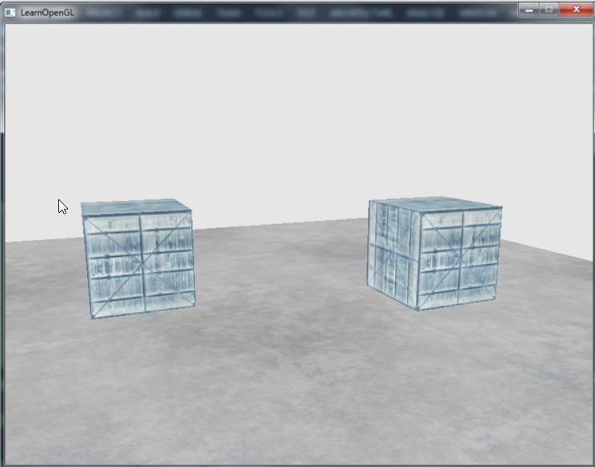

#### 灰度

灰度化(Grayscale)

```
void main()
{
    FragColor = texture(screenTexture, TexCoords);
    float average = 0.2126 * FragColor.r + 0.7152 * FragColor.g + 0.0722 * FragColor.b;
    FragColor = vec4(average, average, average, 1.0);
}
```

#### 核效果

在一个纹理图像上做后期处理的另外一个好处是，我们可以从纹理的其它地方采样颜色值。比如说我们可以在当前纹理坐标的周围取一小块区域，对当前纹理值周围的多个纹理值进行采样。我们可以结合它们创建出很有意思的效果。

核(Kernel)（或卷积矩阵(Convolution Matrix)）是一个类矩阵的数值数组，它的中心为当前的像素，它会用它的核值乘以周围的像素值，并将结果相加变成一个值。所以，基本上我们是在对当前像素周围的纹理坐标添加一个小的偏移量，并根据核将结果合并。下面是核的一个例子：

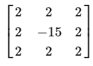

这个核取了8个周围像素值，将它们乘以2，而把当前的像素乘以-15。这个核的例子将周围的像素乘上了一个权重，并将当前像素乘以一个比较大的负权重来平衡结果。

> 你在网上找到的大部分核将所有的权重加起来之后都应该会等于1，如果它们加起来不等于1，这就意味着最终的纹理颜色将会比原纹理值更亮或者更暗了。

核是后期处理一个非常有用的工具，它们使用和实验起来都很简单，网上也能找到很多例子。我们需要稍微修改一下片段着色器，让它能够支持核。我们假设使用的核都是3x3核（实际上大部分核都是）：

```
const float offset = 1.0 / 300.0;  

void main()
{
    vec2 offsets[9] = vec2[](
        vec2(-offset,  offset), // 左上
        vec2( 0.0f,    offset), // 正上
        vec2( offset,  offset), // 右上
        vec2(-offset,  0.0f),   // 左
        vec2( 0.0f,    0.0f),   // 中
        vec2( offset,  0.0f),   // 右
        vec2(-offset, -offset), // 左下
        vec2( 0.0f,   -offset), // 正下
        vec2( offset, -offset)  // 右下
    );

    float kernel[9] = float[](
        -1, -1, -1,
        -1,  9, -1,
        -1, -1, -1
    );

    vec3 sampleTex[9];
    for(int i = 0; i < 9; i++)
    {
        sampleTex[i] = vec3(texture(screenTexture, TexCoords.st + offsets[i]));
    }
    vec3 col = vec3(0.0);
    for(int i = 0; i < 9; i++)
        col += sampleTex[i] * kernel[i];

    FragColor = vec4(col, 1.0);
}
```

锐化(Sharpen)核:

它会采样周围的所有像素，锐化每个颜色值。最后，在采样时我们将每个偏移量加到当前纹理坐标上，获取需要采样的纹理，之后将这些纹理值乘以加权的核值，并将它们加到一起。

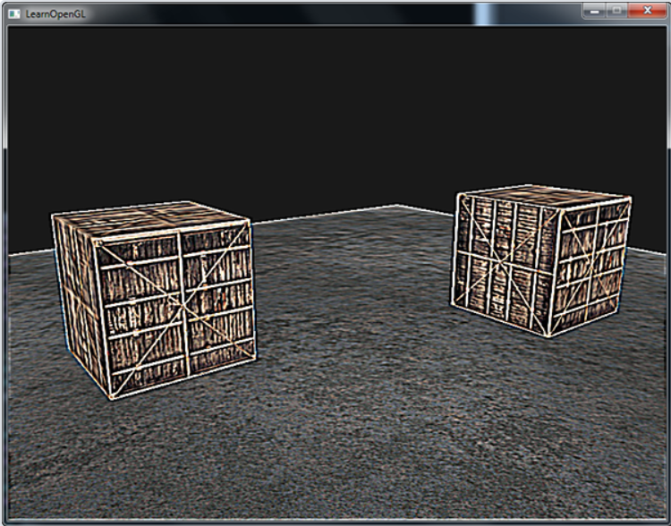

#### 模糊

创建模糊(Blur)效果的核是这样的：

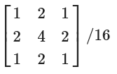

由于所有值的和是16，所以直接返回合并的采样颜色将产生非常亮的颜色，所以我们需要将核的每个值都除以16。最终的核数组将会是：

```
float kernel[9] = float[](
    1.0 / 16, 2.0 / 16, 1.0 / 16,
    2.0 / 16, 4.0 / 16, 2.0 / 16,
    1.0 / 16, 2.0 / 16, 1.0 / 16  
);
```

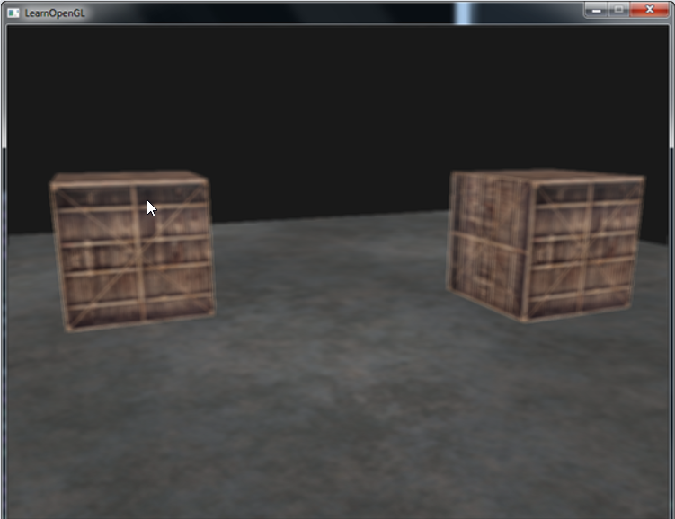

#### 边缘检测

边缘检测(Edge-detection)核和锐化核非常相似

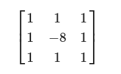

这个核高亮了所有的边缘，而暗化了其它部分，在我们只关心图像的边角的时候是非常有用的。

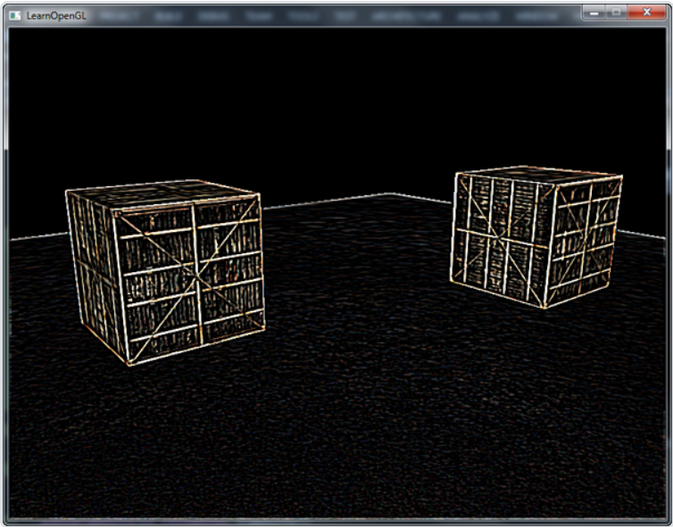

> 注意，核在对屏幕纹理的边缘进行采样的时候，由于还会对中心像素周围的8个像素进行采样，其实会取到纹理之外的像素。由于环绕方式默认是GL_REPEAT，所以在没有设置的情况下取到的是屏幕另一边的像素，而另一边的像素本不应该对中心像素产生影响，这就可能会在屏幕边缘产生很奇怪的条纹。为了消除这一问题，我们可以将屏幕纹理的环绕方式都设置为GL_CLAMP_TO_EDGE。这样子在取到纹理外的像素时，就能够重复边缘的像素来更精确地估计最终的值了。

## 立方体贴图 cubemap

将多个纹理组合起来映射到一张纹理上的一种纹理类型：立方体贴图(Cube Map)

### 天空盒(Skybox)

绘制天空盒时，我们需要将它变为场景中的第一个渲染的物体，并且禁用深度写入。这样子天空盒就会永远被绘制在其它物体的背后了。

目前我们是首先渲染天空盒，之后再渲染场景中的其它物体。这样子能够工作，但不是非常高效。如果我们先渲染天空盒，我们就会对屏幕上的每一个像素运行一遍片段着色器，即便只有一小部分的天空盒最终是可见的。可以使用提前深度测试(Early Depth Testing)轻松丢弃掉的片段能够节省我们很多宝贵的带宽。

在[坐标系统](https://learnopengl-cn.github.io/01%20Getting%20started/08%20Coordinate%20Systems/)小节中我们说过，**透视除法**是在顶点着色器运行之后执行的，将gl_Position的 `xyz`坐标除以w分量。我们又从[深度测试](https://learnopengl-cn.github.io/04%20Advanced%20OpenGL/01%20Depth%20testing/)小节中知道，相除结果的z分量等于顶点的深度值。使用这些信息，我们可以将输出位置的z分量等于它的w分量，让z分量永远等于1.0，这样子的话，当透视除法执行之后，z分量会变为 `w / w = 1.0`。

### 环境映射(Environment Mapping)

反射(Reflection)和折射(Refraction)

#### 反射

反射这个属性表现为物体（或物体的一部分）反射它周围环境，即根据观察者的视角，物体的颜色或多或少等于它的环境。镜子就是一个反射性物体：它会根据观察者的视角反射它周围的环境。

反射的原理并不难。下面这张图展示了我们如何计算反射向量，并如何使用这个向量来从立方体贴图中采样：

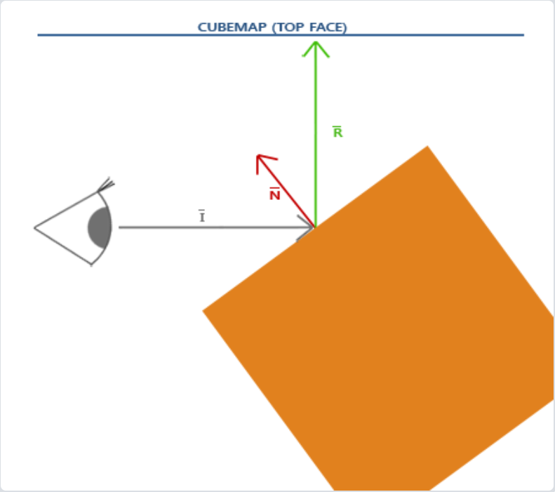

我们根据观察方向向量**I**¯和物体的法向量**N**¯，来计算反射向量**R**¯。我们可以使用GLSL内建的reflect函数来计算这个反射向量。最终的**R**¯向量将会作为索引/采样立方体贴图的方向向量，返回环境的颜色值。最终的结果是物体看起来反射了天空盒。

#### 折射

[斯涅尔定律](https://en.wikipedia.org/wiki/Snell%27s_law)(Snell’s Law)  菲涅尔?

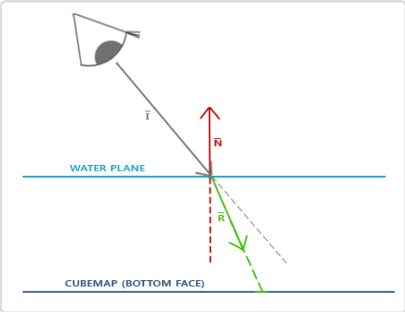

| 材质 | 折射率 |
| ---- | ------ |
| 空气 | 1.00   |
| 水   | 1.33   |
| 冰   | 1.309  |
| 玻璃 | 1.52   |
| 钻石 | 2.42   |

#### 动态环境贴图

通过使用帧缓冲，我们能够为物体的6个不同角度创建出场景的纹理，并在每个渲染迭代中将它们储存到一个立方体贴图中。之后我们就可以使用这个（动态生成的）立方体贴图来创建出更真实的，包含其它物体的，反射和折射表面了。这就叫做动态环境映射(Dynamic Environment Mapping)，因为我们动态创建了物体周围的立方体贴图，并将其用作环境贴图。

虽然它看起来很棒，但它有一个很大的缺点：我们需要为使用环境贴图的物体渲染场景6次，这是对程序是非常大的性能开销。现代的程序通常会尽可能使用天空盒，并在可能的时候使用预编译的立方体贴图，只要它们能产生一点动态环境贴图的效果。虽然动态环境贴图是一个很棒的技术，但是要想在不降低性能的情况下让它工作还是需要非常多的技巧的。


## 高级数据

!!! OpenGL中的缓冲只是一个管理特定内存块的对象，没有其它更多的功能了。在我们将它绑定到一个缓冲目标(Buffer Target)时，我们才赋予了其意义。当我们绑定一个缓冲到GL_ARRAY_BUFFER时，它就是一个顶点数组缓冲，但我们也可以很容易地将其绑定到GL_ELEMENT_ARRAY_BUFFER。OpenGL内部会为每个目标储存一个缓冲，并且会根据目标的不同，以不同的方式处理缓冲。

到目前为止，我们一直是调用glBufferData函数来填充缓冲对象所管理的内存，这个函数会分配一块GPU内存，并将数据添加到这块内存中。如果我们将它的 `data`参数设置为 `NULL`，那么这个函数将只会分配内存，但不进行填充。这在我们需要 **预留** (Reserve)特定大小的内存，之后回到这个缓冲一点一点填充的时候会很有用。

除了使用一次函数调用填充整个缓冲之外，我们也可以使用glBufferSubData，填充缓冲的特定区域。这个函数需要一个缓冲目标、一个偏移量、数据的大小和数据本身作为它的参数。这个函数不同的地方在于，我们可以提供一个偏移量，指定从**何处**开始填充这个缓冲。这能够让我们插入或者更新缓冲内存的某一部分。要注意的是，缓冲需要有足够的已分配内存，所以对一个缓冲调用glBufferSubData之前必须要先调用glBufferData。

```
glBufferSubData(GL_ARRAY_BUFFER, 24, sizeof(data), &data); // 范围： [24, 24 + sizeof(data)]
```

将数据导入缓冲的另外一种方法是，请求缓冲内存的指针，直接将数据复制到缓冲当中。通过调用glMapBuffer函数，OpenGL会返回当前绑定缓冲的内存指针，供我们操作：

```
float data[] = {
  0.5f, 1.0f, -0.35f
  ...
};
glBindBuffer(GL_ARRAY_BUFFER, buffer);
// 获取指针
void *ptr = glMapBuffer(GL_ARRAY_BUFFER, GL_WRITE_ONLY);
// 复制数据到内存
memcpy(ptr, data, sizeof(data));
// 记得告诉OpenGL我们不再需要这个指针了
glUnmapBuffer(GL_ARRAY_BUFFER);
```

当我们使用glUnmapBuffer函数，告诉OpenGL我们已经完成指针操作之后，OpenGL就会知道你已经完成了。在解除映射(Unmapping)之后，指针将会不再可用，并且如果OpenGL能够成功将您的数据映射到缓冲中，这个函数将会返回GL_TRUE。

如果要直接映射数据到缓冲，而不事先将其存储到临时内存中，glMapBuffer这个函数会很有用。比如说，你可以从文件中读取数据，并直接将它们复制到缓冲内存中。

### 分批顶点属性


通过使用glVertexAttribPointer，我们能够指定顶点数组缓冲内容的属性布局。在顶点数组缓冲中，我们对属性进行了交错(Interleave)处理，也就是说，我们将每一个顶点的位置、法线和/或纹理坐标紧密放置在一起。既然我们现在已经对缓冲有了更多的了解，我们可以采取另一种方式。

我们可以做的是，将每一种属性类型的向量数据打包(Batch)为一个大的区块，而不是对它们进行交错储存。与交错布局123123123123不同，我们将采用分批(Batched)的方式111122223333。

当从文件中加载顶点数据的时候，你通常获取到的是一个位置数组、一个法线数组和/或一个纹理坐标数组。我们需要花点力气才能将这些数组转化为一个大的交错数据数组。使用分批的方式会是更简单的解决方案，我们可以很容易使用glBufferSubData函数实现：

```
float positions[] = { ... };
float normals[] = { ... };
float tex[] = { ... };
// 填充缓冲
glBufferSubData(GL_ARRAY_BUFFER, 0, sizeof(positions), &positions);
glBufferSubData(GL_ARRAY_BUFFER, sizeof(positions), sizeof(normals), &normals);
glBufferSubData(GL_ARRAY_BUFFER, sizeof(positions) + sizeof(normals), sizeof(tex), &tex);
```


这样子我们就能直接将属性数组作为一个整体传递给缓冲，而不需要事先处理它们了。我们仍可以将它们合并为一个大的数组，再使用glBufferData来填充缓冲，但对于这种工作，使用glBufferSubData会更合适一点。

我们还需要更新顶点属性指针来反映这些改变：

```
glVertexAttribPointer(0, 3, GL_FLOAT, GL_FALSE, 3 * sizeof(float), 0);  
glVertexAttribPointer(1, 3, GL_FLOAT, GL_FALSE, 3 * sizeof(float), (void*)(sizeof(positions)));  
glVertexAttribPointer(
  2, 2, GL_FLOAT, GL_FALSE, 2 * sizeof(float), (void*)(sizeof(positions) + sizeof(normals)));
```


注意 `stride`参数等于顶点属性的大小，因为下一个顶点属性向量能在3个（或2个）分量之后找到。

这给了我们设置顶点属性的另一种方法。使用哪种方法都是可行的，它只是设置顶点属性的一种更整洁的方式。但是，推荐使用交错方法，因为这样一来，每个顶点着色器运行时所需要的顶点属性在内存中会更加紧密对齐。


### 复制缓冲

当你的缓冲已经填充好数据之后，你可能会想与其它的缓冲共享其中的数据，或者想要将缓冲的内容复制到另一个缓冲当中。glCopyBufferSubData能够让我们相对容易地从一个缓冲中复制数据到另一个缓冲中。这个函数的原型如下：

```
void glCopyBufferSubData(GLenum readtarget, GLenum writetarget, GLintptr readoffset,
                         GLintptr writeoffset, GLsizeiptr size);
```


`readtarget`和 `writetarget`参数需要填入复制源和复制目标的缓冲目标。比如说，我们可以将VERTEX_ARRAY_BUFFER缓冲复制到VERTEX_ELEMENT_ARRAY_BUFFER缓冲，分别将这些缓冲目标设置为读和写的目标。当前绑定到这些缓冲目标的缓冲将会被影响到。

但如果我们想读写数据的两个不同缓冲都为顶点数组缓冲该怎么办呢？我们不能同时将两个缓冲绑定到同一个缓冲目标上。正是出于这个原因，OpenGL提供给我们另外两个缓冲目标，叫做GL_COPY_READ_BUFFER和GL_COPY_WRITE_BUFFER。我们接下来就可以将需要的缓冲绑定到这两个缓冲目标上，并将这两个目标作为 `readtarget`和 `writetarget`参数。

接下来glCopyBufferSubData会从 `readtarget`中读取 `size`大小的数据，并将其写入 `writetarget`缓冲的 `writeoffset`偏移量处。下面这个例子展示了如何复制两个顶点数组缓冲：

```
glBindBuffer(GL_COPY_READ_BUFFER, vbo1);
glBindBuffer(GL_COPY_WRITE_BUFFER, vbo2);
glCopyBufferSubData(GL_COPY_READ_BUFFER, GL_COPY_WRITE_BUFFER, 0, 0, sizeof(vertexData));
```

我们也可以只将 `writetarget`缓冲绑定为新的缓冲目标类型之一：

```
float vertexData[] = { ... };
glBindBuffer(GL_ARRAY_BUFFER, vbo1);
glBindBuffer(GL_COPY_WRITE_BUFFER, vbo2);
glCopyBufferSubData(GL_ARRAY_BUFFER, GL_COPY_WRITE_BUFFER, 0, 0, sizeof(vertexData));
```

有了这些关于如何操作缓冲的额外知识，我们已经能够以更有意思的方式使用它们了。当你越深入OpenGL时，这些新的缓冲方法将会变得更加有用。在[下一节](https://learnopengl-cn.github.io/04%20Advanced%20OpenGL/08%20Advanced%20GLSL/)中，在我们讨论Uniform缓冲对象(Uniform Buffer Object)时，我们将会充分利用glBufferSubData。

123

## 高级GLSL

内建变量(Built-in Variable)

Uniform缓冲对象(Uniform Buffer Object)


### GLSL的内建变量

#### 顶点着色器变量

gl_Position

gl_PointSize

glEnable(GL_PROGRAM_POINT_SIZE); // 开启了才能修改 gl_PointSize

## 几何着色器


## 实例化


## 抗锯齿


# 复习

++++wo shi fen ge xian++++++++++++++++++++++++++++++++++++++++++++++++++++++++++++++++++++++++++++++++++++++++++++++++++++++++++++++++++++++

# 注意点 非常重要

## 1. 绘制

!!!绘制不是绘制全屏幕,而是绘制有比如vao,vbo数据的地方!!!

vs/fs 这些,是绘制有数据的点,而不是所有的.

不是整个屏幕扫描!!!

一定要注意,不然概念全乱了!!!

## 2.时序

### 测试

模板测试->深度测试->混合

### early z

Early-Z 是一种优化技术，它发生在顶点着色器和片元着色器之间，会提前进行深度测试，将很多无效的像素提前剔除，避免它们进入耗时的片元着色器阶段。而模板测试默认是不开启的，若开启，它是在片元着色器之后执行的，GPU 会读取模板缓冲区中该片元位置的模板值，并与参考值进行比较，以确定该片元是否通过测试。也就是说，Early-Z 在片元着色器之前起作用，而模板测试在片元着色器之后进行，所以 Early-Z 在模板测试前面。

## 次序无关透明度(Order Independent Transparency, OIT)

## 渲染缓冲/颜色缓冲

> 渲染缓冲（Renderbuffer）看似“可以被纹理替代”，但实际上它的存在是为了**填补纹理在特定场景下的性能和功能空白**。简单说：**纹理的优势是“灵活可采样”，而渲染缓冲的优势是“高效纯输出”**——在不需要采样的场景下，渲染缓冲比纹理更快、更省资源，这就是它不可替代的核心价值。
>
> ### 为什么渲染缓冲必须存在？3个关键原因
>
> #### 1. 硬件对渲染缓冲有特殊优化，写入速度更快
>
> 纹理为了支持“着色器采样”，其内存布局必须满足通用的纹理访问规则（如对齐要求、mipmap支持等），这会增加额外的存储和写入开销。而渲染缓冲的设计目标是**“只写不读（对CPU/GPU着色器而言）”**，硬件可以对其进行极致优化：
>
> - 内存布局完全适配渲染管线（如直接对应帧缓冲的扫描线顺序），写入时无需额外转换。
> - 可以使用硬件原生的压缩格式（如深度缓冲的专用压缩算法），节省带宽和内存。
>
> 例如，深度缓冲用渲染缓冲存储时，GPU写入深度值的速度通常比用纹理快10%~30%（具体依赖硬件，但趋势一致）。
>
> #### 2. 多采样场景下，渲染缓冲是唯一高效选择
>
> 多采样抗锯齿（MSAA）需要存储每个像素的多个采样点数据（如4x MSAA要存4个深度/颜色样本）。
>
> - 纹理虽然支持多采样（`GL_TEXTURE_2D_MULTISAMPLE`），但采样数据的格式是“打包的”，着色器无法直接访问单个样本（必须通过 `texelFetch` 且格式受限），且内存开销更大。
> - 渲染缓冲的多采样存储是**硬件优化的“原生格式”**，专门用于MSAA的样本合并（Resolve），写入和合并效率远高于多采样纹理。
>
> 因此，MSAA的深度/模板缓冲几乎必用渲染缓冲，否则性能会严重下降。
>
> #### 3. 避免“不必要的功能开销”
>
> 纹理支持的采样、mipmap、过滤等功能，在深度/模板缓冲等场景下完全用不上。如果强行用纹理存储这些数据，相当于“为不需要的功能买单”：
>
> - 内存占用更高（纹理需额外存储采样元数据）。
> - GPU需维护纹理状态（如过滤模式、边界处理），增加管线负担。
>
> 渲染缓冲则“按需精简”，只保留必要的存储功能，避免这些冗余开销。
>
> ### 一句话总结：存在即合理
>
> - 如果你需要**“采样渲染结果”**（如后处理、动态纹理），用纹理——灵活性优先。
> - 如果你只需要**“高效存储渲染过程数据”**（如深度、模板、MSAA样本），用渲染缓冲——性能优先。
>
> 就像“水杯”和“保温杯”：水杯功能多（可以装水、泡茶、当容器），但保温杯在“长时间保温”这件事上更高效。渲染缓冲就是OpenGL为“高效纯输出”场景设计的“保温杯”，无法被纹理完全替代。
>
> 试试这个实验：用纹理和渲染缓冲分别作为深度缓冲，渲染一个100万个三角形的场景，对比帧率——你会直观看到渲染缓冲的性能优势。

# TODO

1. mesh 传入skybox的cubemap

123

## end
