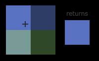
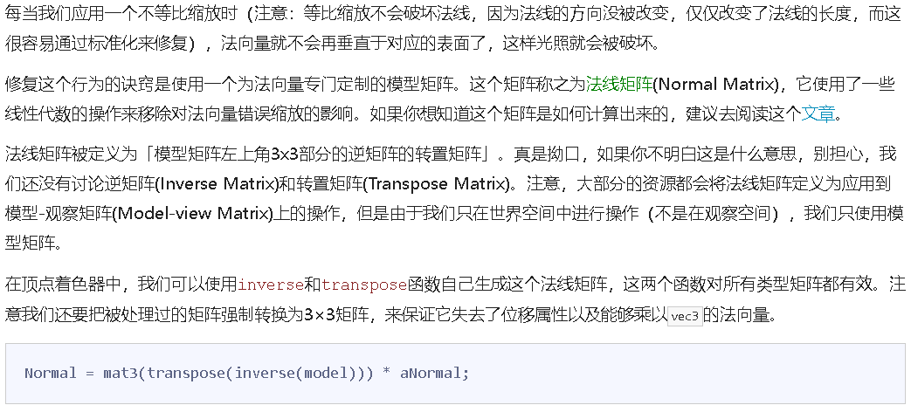

# OpenGL Note

## 概念

顶点数组对象：Vertex Array Object，VAO

顶点缓冲对象：Vertex Buffer Object，VBO

元素缓冲对象：Element Buffer Object，EBO 或 索引缓冲对象 Index Buffer Object，IBO

### render pipeline


> 为了让OpenGL知道我们的坐标和颜色值构成的到底是什么，OpenGL需要你去指定这些数据所表示的渲染类型。我们是希望把这些数据渲染成一系列的点？一系列的三角形？还是仅仅是一个长长的线？做出的这些提示叫做图元(Primitive)，任何一个绘制指令的调用都将把图元传递给OpenGL。这是其中的几个：GL_POINTS、GL_TRIANGLES、GL_LINE_STRIP。

### render pipeline 多看

图形渲染管线的第一个部分是顶点着色器(Vertex Shader)，它把一个单独的顶点作为输入。顶点着色器主要的目的是把3D坐标转为另一种3D坐标（后面会解释），同时顶点着色器允许我们对顶点属性进行一些基本处理。

顶点着色器阶段的输出可以选择性地传递给几何着色器(Geometry Shader)。几何着色器将一组顶点作为输入，这些顶点形成图元，并且能够通过发出新的顶点来形成新的(或其他)图元来生成其他形状。在这个例子中，它从给定的形状中生成第二个三角形。

图元装配(Primitive Assembly)阶段将顶点着色器（或几何着色器）输出的所有顶点作为输入（如果是GL_POINTS，那么就是一个顶点），并将所有的点装配成指定图元的形状；本节例子中是两个三角形。

图元装配阶段的输出会被传入光栅化阶段(Rasterization Stage)，这里它会把图元映射为最终屏幕上相应的像素，生成供片段着色器(Fragment Shader)使用的片段(Fragment)。在片段着色器运行之前会执行裁切(Clipping)。裁切会丢弃超出你的视图以外的所有像素，用来提升执行效率。

OpenGL中的一个片段是OpenGL渲染一个像素所需的所有数据。

片段着色器的主要目的是计算一个像素的最终颜色，这也是所有OpenGL高级效果产生的地方。通常，片段着色器包含3D场景的数据（比如光照、阴影、光的颜色等等），这些数据可以被用来计算最终像素的颜色。

在所有对应颜色值确定以后，最终的对象将会被传到最后一个阶段，我们叫做Alpha测试和混合(Blending)阶段。这个阶段检测片段的对应的深度（和模板(Stencil)）值（后面会讲），用它们来判断这个像素是其它物体的前面还是后面，决定是否应该丢弃。这个阶段也会检查alpha值（alpha值定义了一个物体的透明度）并对物体进行混合(Blend)。所以，即使在片段着色器中计算出来了一个像素输出的颜色，在渲染多个三角形的时候最后的像素颜色也可能完全不同。

可以看到，图形渲染管线非常复杂，它包含很多可配置的部分。然而，对于大多数场合，我们只需要配置顶点和片段着色器就行了。几何着色器是可选的，通常使用它默认的着色器就行了。

在现代OpenGL中，我们**必须**定义至少一个顶点着色器和一个片段着色器（因为GPU中没有默认的顶点/片段着色器）。出于这个原因，刚开始学习现代OpenGL的时候可能会非常困难，因为在你能够渲染自己的第一个三角形之前已经需要了解一大堆知识了。在本节结束你最终渲染出你的三角形的时候，你也会了解到非常多的图形编程知识。

### vertex shader

#### 顶点缓冲对象(Vertex Buffer Objects, VBO)

我们通过顶点缓冲对象(Vertex Buffer Objects, VBO)管理这个内存，它会在GPU内存（通常被称为显存）中储存大量顶点。使用这些缓冲对象的好处是我们可以一次性的发送一大批数据到显卡上，而不是每个顶点发送一次。从CPU把数据发送到显卡相对较慢，所以只要可能我们都要尝试尽量一次性发送尽可能多的数据。当数据发送至显卡的内存中后，顶点着色器几乎能立即访问顶点，这是个非常快的过程。

cpu会向gpu批量的发送数据,而不是一个顶点发送一次.cpu和gpu通信是有瓶颈的.

#### glBindBuffer/glBufferData

opengl 对象都应该有一个唯一ID.比如:

```C++
// 声明
unsigned int VBO;
glGenBuffers(1, &VBO);
// or
glBindBuffer(GL_ARRAY_BUFFER, VBO);
// 把顶点数据复制进去
glBufferData(GL_ARRAY_BUFFER, sizeof(vertices), vertices, GL_STATIC_DRAW);
```

第四个参数指定了我们希望显卡如何管理给定的数据。它有三种形式：

* GL_STATIC_DRAW ：数据不会或几乎不会改变。
* GL_DYNAMIC_DRAW：数据会被改变很多。
* GL_STREAM_DRAW ：数据每次绘制时都会改变。

三角形的位置数据不会改变，每次渲染调用时都保持原样，所以它的使用类型最好是GL_STATIC_DRAW。如果，比如说一个缓冲中的数据将频繁被改变，那么使用的类型就是GL_DYNAMIC_DRAW或GL_STREAM_DRAW，这样就能确保显卡把数据放在能够高速写入的内存部分。

#### glCreateShader/glShaderSource/glCompileShader

```C++
unsigned int vertexShader;
vertexShader = glCreateShader(GL_VERTEX_SHADER);
glShaderSource(vertexShader, 1, &vertexShaderSource, NULL);
glCompileShader(vertexShader);
```

### fragment shader

```C++
unsigned int fragmentShader;
fragmentShader = glCreateShader(GL_FRAGMENT_SHADER);
glShaderSource(fragmentShader, 1, &fragmentShaderSource, NULL);
glCompileShader(fragmentShader);
```

### 着色器程序对象(Shader Program Object)

是多个着色器合并之后并最终链接完成的版本

```C++
unsigned int shaderProgram;
shaderProgram = glCreateProgram();
glAttachShader(shaderProgram, vertexShader);
glAttachShader(shaderProgram, fragmentShader);
glLinkProgram(shaderProgram);

glGetProgramiv(shaderProgram, GL_LINK_STATUS, &success);
if(!success) {
    glGetProgramInfoLog(shaderProgram, 512, NULL, infoLog);
    ...
}

glUseProgram(shaderProgram);
glDeleteShader(vertexShader);
glDeleteShader(fragmentShader);

```

### 链接顶点属性

顶点着色器允许我们指定任何以顶点属性为形式的输入。


* 位置数据被储存为32位（4字节）浮点值。
* 每个位置包含3个这样的值。
* 在这3个值之间没有空隙（或其他值）。这几个值在数组中紧密排列(Tightly Packed)。
* 数据中第一个值在缓冲开始的位置。

有了这些信息我们就可以使用glVertexAttribPointer函数告诉OpenGL该如何解析顶点数据（应用到逐个顶点属性上）了：

```C++
glVertexAttribPointer(0, 3, GL_FLOAT, GL_FALSE, 3 * sizeof(float), (void*)0);
glEnableVertexAttribArray(0);
```

* 第一个参数指定我们要配置的顶点属性。还记得我们在顶点着色器中使用 `layout(location = 0)`定义了position顶点属性的位置值(Location)吗？它可以把顶点属性的位置值设置为 `0`。因为我们希望把数据传递到这一个顶点属性中，所以这里我们传入 `0`。
* 第二个参数指定顶点属性的大小。顶点属性是一个 `vec3`，它由3个值组成，所以大小是3。
* 第三个参数指定数据的类型，这里是GL_FLOAT(GLSL中 `vec*`都是由浮点数值组成的)。
* 下个参数定义我们是否希望数据被标准化(Normalize)。如果我们设置为GL_TRUE，所有数据都会被映射到0（对于有符号型signed数据是-1）到1之间。我们把它设置为GL_FALSE。
* 第五个参数叫做步长(Stride)，它告诉我们在连续的顶点属性组之间的间隔。由于下个组位置数据在3个 `float`之后，我们把步长设置为 `3 * sizeof(float)`。要注意的是由于我们知道这个数组是紧密排列的（在两个顶点属性之间没有空隙）我们也可以设置为0来让OpenGL决定具体步长是多少（只有当数值是紧密排列时才可用）。一旦我们有更多的顶点属性，我们就必须更小心地定义每个顶点属性之间的间隔，我们在后面会看到更多的例子（译注: 这个参数的意思简单说就是从这个属性第二次出现的地方到整个数组0位置之间有多少字节）。
* 最后一个参数的类型是 `void*`，所以需要我们进行这个奇怪的强制类型转换。它表示位置数据在缓冲中起始位置的偏移量(Offset)。由于位置数据在数组的开头，所以这里是0。我们会在后面详细解释这个参数。

> 每个顶点属性从一个VBO管理的内存中获得它的数据，而具体是从哪个VBO（程序中可以有多个VBO）获取则是通过在调用glVertexAttribPointer时绑定到GL_ARRAY_BUFFER的VBO决定的。由于在调用glVertexAttribPointer之前绑定的是先前定义的VBO对象，顶点属性 `0`现在会链接到它的顶点数据。

```C++
// 0. 复制顶点数组到缓冲中供OpenGL使用
glBindBuffer(GL_ARRAY_BUFFER, VBO);
glBufferData(GL_ARRAY_BUFFER, sizeof(vertices), vertices, GL_STATIC_DRAW);
// 1. 设置顶点属性指针
glVertexAttribPointer(0, 3, GL_FLOAT, GL_FALSE, 3 * sizeof(float), (void*)0);
glEnableVertexAttribArray(0);
// 2. 当我们渲染一个物体时要使用着色器程序
glUseProgram(shaderProgram);
// 3. 绘制物体
someOpenGLFunctionThatDrawsOurTriangle();
```

### 顶点数组对象(Vertex Array Object, VAO)

可以像顶点缓冲对象那样被绑定，任何随后的顶点属性调用都会储存在这个VAO中。这样的好处就是，当配置顶点属性指针时，你只需要将那些调用执行一次，之后再绘制物体的时候只需要绑定相应的VAO就行了。这使在不同顶点数据和属性配置之间切换变得非常简单，只需要绑定不同的VAO就行了。刚刚设置的所有状态都将存储在VAO中.

* glEnableVertexAttribArray和glDisableVertexAttribArray的调用。
* 通过glVertexAttribPointer设置的顶点属性配置。
* 通过glVertexAttribPointer调用与顶点属性关联的顶点缓冲对象。


```C++
unsigned int VAO;
glGenVertexArrays(1, &VAO);

// ..:: 初始化代码（只运行一次 (除非你的物体频繁改变)） :: ..
// 1. 绑定VAO
glBindVertexArray(VAO);
// 2. 把顶点数组复制到缓冲中供OpenGL使用
glBindBuffer(GL_ARRAY_BUFFER, VBO);
glBufferData(GL_ARRAY_BUFFER, sizeof(vertices), vertices, GL_STATIC_DRAW);
// 3. 设置顶点属性指针
glVertexAttribPointer(0, 3, GL_FLOAT, GL_FALSE, 3 * sizeof(float), (void*)0);
glEnableVertexAttribArray(0);

[...]

// ..:: 绘制代码（渲染循环中） :: ..
// 4. 绘制物体
glUseProgram(shaderProgram);
glBindVertexArray(VAO);
someOpenGLFunctionThatDrawsOurTriangle(); // 比如 glDrawArrays(GL_TRIANGLES, 0, 3);

```

### 元素缓冲对象(Element Buffer Object，EBO) / 索引缓冲对象(Index Buffer Object，IBO)

 EBO是一个缓冲区，就像一个顶点缓冲区对象一样，它存储 OpenGL 用来决定要绘制哪些顶点的索引。这种所谓的索引绘制(Indexed Drawing)正是我们问题的解决方案.

```C++
float vertices[] = {
    0.5f, 0.5f, 0.0f,   // 右上角
    0.5f, -0.5f, 0.0f,  // 右下角
    -0.5f, -0.5f, 0.0f, // 左下角
    -0.5f, 0.5f, 0.0f   // 左上角
};

unsigned int indices[] = {
    // 注意索引从0开始! 
    // 此例的索引(0,1,2,3)就是顶点数组vertices的下标，
    // 这样可以由下标代表顶点组合成矩形

    0, 1, 3, // 第一个三角形
    1, 2, 3  // 第二个三角形
};

// 声明 EBO
unsigned int EBO;
glGenBuffers(1, &EBO);

// 数据复制到 EBO
glBindBuffer(GL_ELEMENT_ARRAY_BUFFER, EBO);
glBufferData(GL_ELEMENT_ARRAY_BUFFER, sizeof(indices), indices, GL_STATIC_DRAW);

// 设置绘制
glBindBuffer(GL_ELEMENT_ARRAY_BUFFER, EBO);
glDrawElements(GL_TRIANGLES, 6, GL_UNSIGNED_INT, 0);


```


```C++
// ..:: 初始化代码 :: ..
// 1. 绑定顶点数组对象
glBindVertexArray(VAO);
// 2. 把我们的顶点数组复制到一个顶点缓冲中，供OpenGL使用
glBindBuffer(GL_ARRAY_BUFFER, VBO);
glBufferData(GL_ARRAY_BUFFER, sizeof(vertices), vertices, GL_STATIC_DRAW);
// 3. 复制我们的索引数组到一个索引缓冲中，供OpenGL使用
glBindBuffer(GL_ELEMENT_ARRAY_BUFFER, EBO);
glBufferData(GL_ELEMENT_ARRAY_BUFFER, sizeof(indices), indices, GL_STATIC_DRAW);
// 4. 设定顶点属性指针
glVertexAttribPointer(0, 3, GL_FLOAT, GL_FALSE, 3 * sizeof(float), (void*)0);
glEnableVertexAttribArray(0);

[...]

// ..:: 绘制代码（渲染循环中） :: ..
glUseProgram(shaderProgram);
glBindVertexArray(VAO);
glDrawElements(GL_TRIANGLES, 6, GL_UNSIGNED_INT, 0);
glBindVertexArray(0);


```

***当目标是GL_ELEMENT_ARRAY_BUFFER的时候，VAO会储存glBindBuffer的函数调用。这也意味着它也会储存解绑调用，所以确保你没有在解绑VAO之前解绑索引数组缓冲，否则它就没有这个EBO配置了。***


```C++
// 位置属性
glVertexAttribPointer(0, 3, GL_FLOAT, GL_FALSE, 6 * sizeof(float), (void*)0);
glEnableVertexAttribArray(0);
// 颜色属性
glVertexAttribPointer(1, 3, GL_FLOAT, GL_FALSE, 6 * sizeof(float), (void*)(3* sizeof(float)));
glEnableVertexAttribArray(1);

```

片段着色器中进行的所谓片段插值(Fragment Interpolation)的结果。当渲染一个三角形时，光栅化(Rasterization)阶段通常会造成比原指定顶点更多的片段。光栅会根据每个片段在三角形形状上所处相对位置决定这些片段的位置。
基于这些位置，它会插值(Interpolate)所有片段着色器的输入变量。比如说，我们有一个线段，上面的端点是绿色的，下面的端点是蓝色的。如果一个片段着色器在线段的70%的位置运行，它的颜色输入属性就会是一个绿色和蓝色的线性结合；更精确地说就是30%蓝 + 70%绿。

### texture

sampling


#### 纹理环绕方式

| 环绕方式           | 描述                                                                                   |
| ------------------ | -------------------------------------------------------------------------------------- |
| GL_REPEAT          | 对纹理的默认行为。重复纹理图像。                                                       |
| GL_MIRRORED_REPEAT | 和GL_REPEAT一样，但每次重复图片是镜像放置的。                                          |
| GL_CLAMP_TO_EDGE   | 纹理坐标会被约束在0到1之间，超出的部分会重复纹理坐标的边缘，产生一种边缘被拉伸的效果。 |
| GL_CLAMP_TO_BORDER | 超出的坐标为用户指定的边缘颜色。                                                       |


```C++
glTexParameteri(GL_TEXTURE_2D, GL_TEXTURE_WRAP_S, GL_MIRRORED_REPEAT);
glTexParameteri(GL_TEXTURE_2D, GL_TEXTURE_WRAP_T, GL_MIRRORED_REPEAT);

float borderColor[] = { 1.0f, 1.0f, 0.0f, 1.0f };
glTexParameterfv(GL_TEXTURE_2D, GL_TEXTURE_BORDER_COLOR, borderColor);
```

#### 纹理过滤

纹理坐标不依赖于分辨率(Resolution)，它可以是任意浮点值，所以OpenGL需要知道怎样将纹理像素(Texture Pixel，也叫Texel，译注1)映射到纹理坐标。当你有一个很大的物体但是纹理的分辨率很低的时候这就变得很重要了。你可能已经猜到了，OpenGL也有对于纹理过滤(Texture Filtering)的选项。纹理过滤有很多个选项，但是现在我们只讨论最重要的两种：GL_NEAREST和GL_LINEAR。

Texture Pixel也叫Texel，你可以想象你打开一张 `.jpg`格式图片，不断放大你会发现它是由无数像素点组成的，这个点就是纹理像素；注意不要和纹理坐标搞混，纹理坐标是你给模型顶点设置的那个数组，OpenGL以这个顶点的纹理坐标数据去查找纹理图像上的像素，然后进行采样提取纹理像素的颜色。

GL_NEAREST（也叫邻近过滤，Nearest Neighbor Filtering）是OpenGL默认的纹理过滤方式



GL_LINEAR（也叫线性过滤，(Bi)linear Filtering）它会基于纹理坐标附近的纹理像素，计算出一个插值，近似出这些纹理像素之间的颜色。


当进行放大(Magnify)和缩小(Minify)操作的时候可以设置纹理过滤的选项，比如你可以在纹理被缩小的时候使用邻近过滤，被放大时使用线性过滤。我们需要使用glTexParameter*函数为放大和缩小指定过滤方式。这段代码看起来会和纹理环绕方式的设置很相似：

```C++
glTexParameteri(GL_TEXTURE_2D, GL_TEXTURE_MIN_FILTER, GL_NEAREST);
glTexParameteri(GL_TEXTURE_2D, GL_TEXTURE_MAG_FILTER, GL_LINEAR);
```

#### 多级渐远纹理 Mipmap

它简单来说就是一系列的纹理图像，后一个纹理图像是前一个的二分之一。多级渐远纹理背后的理念很简单：距观察者的距离超过一定的阈值，OpenGL会使用不同的多级渐远纹理，即最适合物体的距离的那个。由于距离远，解析度不高也不会被用户注意到。同时，多级渐远纹理另一加分之处是它的性能非常好。让我们看一下多级渐远纹理是什么样子的：


glGenerateMipmap

在渲染中切换多级渐远纹理级别(Level)时，OpenGL在两个不同级别的多级渐远纹理层之间会产生不真实的生硬边界。就像普通的纹理过滤一样，切换多级渐远纹理级别时你也可以在两个不同多级渐远纹理级别之间使用NEAREST和LINEAR过滤。为了指定不同多级渐远纹理级别之间的过滤方式，你可以使用下面四个选项中的一个代替原有的过滤方式：

| 过滤方式                  | 描述                                                                     |
| ------------------------- | ------------------------------------------------------------------------ |
| GL_NEAREST_MIPMAP_NEAREST | 使用最邻近的多级渐远纹理来匹配像素大小，并使用邻近插值进行纹理采样       |
| GL_LINEAR_MIPMAP_NEAREST  | 使用最邻近的多级渐远纹理级别，并使用线性插值进行采样                     |
| GL_NEAREST_MIPMAP_LINEAR  | 在两个最匹配像素大小的多级渐远纹理之间进行线性插值，使用邻近插值进行采样 |
| GL_LINEAR_MIPMAP_LINEAR   | 在两个邻近的多级渐远纹理之间使用线性插值，并使用线性插值进行采样         |

就像纹理过滤一样，我们可以使用glTexParameteri将过滤方式设置为前面四种提到的方法之一：

```C++
glTexParameteri(GL_TEXTURE_2D, GL_TEXTURE_MIN_FILTER, GL_LINEAR_MIPMAP_LINEAR);
glTexParameteri(GL_TEXTURE_2D, GL_TEXTURE_MAG_FILTER, GL_LINEAR);
```

##### 生成纹理

```C++
    unsigned int texture1;
    // texture 1
    // ---------
    glGenTextures(1, &texture1);
    glBindTexture(GL_TEXTURE_2D, texture1);
    // set the texture wrapping parameters
    glTexParameteri(GL_TEXTURE_2D, GL_TEXTURE_WRAP_S, GL_REPEAT);
    glTexParameteri(GL_TEXTURE_2D, GL_TEXTURE_WRAP_T, GL_REPEAT);
    // set texture filtering parameters
    glTexParameteri(GL_TEXTURE_2D, GL_TEXTURE_MIN_FILTER, GL_LINEAR);
    glTexParameteri(GL_TEXTURE_2D, GL_TEXTURE_MAG_FILTER, GL_LINEAR);
    // load image, create texture and generate mipmaps
    int width, height, nrChannels;
    stbi_set_flip_vertically_on_load(true); // tell stb_image.h to flip loaded texture's on the y-axis.
    unsigned char *data = stbi_load("resources/textures/container.jpg"), &width, &height, &nrChannels, 0);
    if (data)
    {
        glTexImage2D(GL_TEXTURE_2D, 0, GL_RGB, width, height, 0, GL_RGB, GL_UNSIGNED_BYTE, data);
        glGenerateMipmap(GL_TEXTURE_2D);
    }
    else
    {
        std::cout << "Failed to load texture" << std::endl;
    }
    stbi_image_free(data);

```

##### 应用纹理

```C++
float vertices[] = {
//     ---- 位置 ----       ---- 颜色 ----     - 纹理坐标 -
     0.5f,  0.5f, 0.0f,   1.0f, 0.0f, 0.0f,   1.0f, 1.0f,   // 右上
     0.5f, -0.5f, 0.0f,   0.0f, 1.0f, 0.0f,   1.0f, 0.0f,   // 右下
    -0.5f, -0.5f, 0.0f,   0.0f, 0.0f, 1.0f,   0.0f, 0.0f,   // 左下
    -0.5f,  0.5f, 0.0f,   1.0f, 1.0f, 0.0f,   0.0f, 1.0f    // 左上
};

```


```C++
glVertexAttribPointer(2, 2, GL_FLOAT, GL_FALSE, 8 * sizeof(float), (void*)(6 * sizeof(float)));
glEnableVertexAttribArray(2);
```

uniform sampler2D ourTexture;

### Transform

点成的几何意义:

1. 计算向量夹角
2. 计算向量投影

叉乘几何意义

1. 生成垂直向量
2. 计算面积
3. 判断向量相对位置

#### 缩放


#### 位移


#### 旋转


***矩阵组合不满足交换律!!!!!***


#### 四元数

你提的问题很有深度，四元数是解决三维旋转问题的重要数学工具，核心是用四个数来表示三维空间中的旋转，避免“万向锁”问题。

四元数由爱尔兰数学家威廉·罗恩·哈密顿于1843年提出，本质是一种超复数，通常记为 **q = w + xi + yj + zk**。其中w是实部，x、y、z是虚部，i、j、k是三个不同的虚数单位，且满足特定乘法规则（i² = j² = k² = -1，ij = k，ji = -k等）。

##### 四元数的核心构成与意义

1. **实部（w）**：与旋转角度相关，计算公式为 **w = cos(θ/2)**，其中θ是绕旋转轴旋转的角度。
2. **虚部（x, y, z）**：与旋转轴方向相关，计算公式为 **(x, y, z) = (nₓ·sin(θ/2), nᵧ·sin(θ/2), n_z·sin(θ/2))**，其中(nₓ, nᵧ, n_z)是旋转轴的单位向量。
3. **单位四元数**：用于表示旋转的四元数必须是单位四元数，即满足 **w² + x² + y² + z² = 1**，否则需要进行归一化处理。

---

##### 四元数的关键优势（对比欧拉角）

在三维旋转场景中，四元数主要解决了欧拉角的两大痛点：

- **避免万向锁（Gimbal Lock）**：欧拉角通过三个角度（如俯仰、偏航、滚转）描述旋转，当两个旋转轴重合时会丢失一个自由度，而四元数用四个参数描述旋转，从数学上杜绝了这一问题。
- **简化插值计算**：在动画、机器人控制等需要平滑过渡旋转的场景中，四元数的球面线性插值（Slerp）能实现更流畅的过渡，而欧拉角插值容易出现卡顿或不自然的旋转。

---

##### 四元数的主要应用场景

- **3D图形与游戏开发**：用于模型、相机的旋转计算，如Unity、Unreal Engine等引擎均内置四元数运算模块。
- **机器人与航空航天**：机械臂的姿态控制、飞行器的姿态导航，需高精度且无万向锁的旋转描述。
- **虚拟现实（VR）/增强现实（AR）**：头显设备的姿态追踪，确保虚拟场景与用户头部运动的实时、平滑同步。

四元数的应用计算核心围绕“**旋转表示**”和“**旋转操作**”展开，最常用的场景是用四元数旋转三维空间中的点，具体可拆解为明确步骤和实际案例。

#### 一、核心应用：用四元数旋转三维点

假设我们要将三维空间中的点 **P(x, y, z)**，绕单位旋转轴 **n(nₓ, nᵧ, n_z)** 旋转 **θ** 角，得到新点 **P’**，计算步骤如下：

1. **构建旋转四元数 q**根据四元数与旋转的对应关系，先确定单位四元数的四个分量：

   - 实部：**w = cos(θ/2)**
   - 虚部：**x = nₓ·sin(θ/2)，y = nᵧ·sin(θ/2)，z = n_z·sin(θ/2)**
     例如：绕z轴（n=(0,0,1)）旋转90°（θ=π/2），则 w=cos(π/4)=√2/2≈0.707，x=0，y=0，z=1·sin(π/4)=√2/2≈0.707，即 q=(0.707, 0, 0, 0.707)。
2. **将三维点 P 转化为“纯四元数 p”**纯四元数的实部为0，虚部对应点的坐标，即：**p = 0 + x_P·i + y_P·j + z_P·k**例如：点 P=(1,0,0)，对应的纯四元数 p=(0, 1, 0, 0)。
3. **计算旋转后的纯四元数 p’**核心公式为 **p’ = q · p · q⁻¹**，其中：

   - “·”表示四元数乘法（需遵循虚数单位乘法规则：i²=j²=k²=-1，ij=k，ji=-k等）；
   - **q⁻¹** 是 q 的逆四元数，由于 q 是单位四元数，其逆等于共轭，即 **q⁻¹ = (w, -x, -y, -z)**。
     沿用上例：q=(0.707,0,0,0.707)，q⁻¹=(0.707,0,0,-0.707)，p=(0,1,0,0)，计算后 p’=(0, 0, 1, 0)，对应新点 P’=(0,1,0)，符合绕z轴旋转90°的结果。
4. **从 p’ 提取旋转后的点 P’**
   忽略 p’ 的实部（旋转后实部仍为0），其虚部的x、y、z分量即为 P’ 的坐标。

#### 二、其他关键应用计算

##### 1. 四元数插值（Slerp）

用于实现两个旋转状态的平滑过渡（如动画中物体的旋转过渡），公式为：**Slerp(q₁, q₂, t) = (sin((1-t)θ)/sinθ)·q₁ + (sin(tθ)/sinθ)·q₂**其中：

- q₁、q₂ 是两个单位四元数；
- t 是插值参数（0≤t≤1），t=0时结果为q₁，t=1时结果为q₂；
- θ 是 q₁ 与 q₂ 的夹角，由点积计算：**cosθ = q₁·w·q₂·w + q₁·x·q₂·x + q₁·y·q₂·y + q₁·z·q₂·z**。

##### 2. 四元数与欧拉角的转换

满足不同场景下的格式需求，以“四元数转欧拉角（Z-Y-X顺序，即偏航-俯仰-滚转）”为例：

- 滚转角（roll）：**φ = arctan2(2(wx + yz), 1 - 2(x² + y²))**
- 俯仰角（pitch）：**θ = arcsin(2(wy - xz))**
- 偏航角（yaw）：**ψ = arctan2(2(wz + xy), 1 - 2(y² + z²))**

#### 三、实际应用注意事项

1. **必须归一化**：用于旋转的四元数必须是单位四元数，计算中若因误差导致模长偏离1，需通过“各分量除以模长”进行归一化（模长 = √(w²+x²+y²+z²)）。
2. **避免手动复杂计算**：实际开发中（如游戏、机器人控制），无需手动计算四元数乘法，Unity、Unreal Engine 或 Python 的 `numpy-quaternion` 库均提供封装好的API（如 `Quaternion.RotatePoint`）。


### 坐标系 Coordinate Systems

* 局部空间(Local Space，或者称为物体空间(Object Space))
* 世界空间(World Space)
* 观察空间(View Space，或者称为视觉空间(Eye Space))
* 裁剪空间(Clip Space)
* 屏幕空间(Screen Space)

为了将坐标从一个坐标系变换到另一个坐标系，我们需要用到几个变换矩阵，最重要的几个分别是模型(Model)、观察(View)、投影(Projection)三个矩阵。我们的顶点坐标起始于局部空间(Local Space)，在这里它称为局部坐标(Local Coordinate)，它在之后会变为世界坐标(World Coordinate)，观察坐标(View Coordinate)，裁剪坐标(Clip Coordinate)，并最后以屏幕坐标(Screen Coordinate)的形式结束。下面的这张图展示了整个流程以及各个变换过程做了什么：


1. 局部坐标是对象相对于局部原点的坐标，也是物体起始的坐标。
2. 下一步是将局部坐标变换为世界空间坐标，世界空间坐标是处于一个更大的空间范围的。这些坐标相对于世界的全局原点，它们会和其它物体一起相对于世界的原点进行摆放。
3. 接下来我们将世界坐标变换为观察空间坐标，使得每个坐标都是从摄像机或者说观察者的角度进行观察的。
4. 坐标到达观察空间之后，我们需要将其投影到裁剪坐标。裁剪坐标会被处理至-1.0到1.0的范围内，并判断哪些顶点将会出现在屏幕上。
5. 最后，我们将裁剪坐标变换为屏幕坐标，我们将使用一个叫做视口变换(Viewport Transform)的过程。视口变换将位于-1.0到1.0范围的坐标变换到由glViewport函数所定义的坐标范围内。最后变换出来的坐标将会送到光栅器，将其转化为片段。

观察矩阵(View Matrix)

裁剪掉(Clipped)

裁剪空间(Clip Space)

裁剪体积(Clipping Volume)

**观察箱** (Viewing Box)被称为平截头体(Frustum)

投影(Projection)

透视除法(Perspective Division)

正射投影矩阵(Orthographic Projection Matrix)或一个透视投影矩阵(Perspective Projection Matrix)


glm::ortho(0.0f, 800.0f, 0.0f, 600.0f, 0.1f, 100.0f);


glm::mat4 proj = glm::perspective(glm::radians(45.0f), (float)width/(float)height, 0.1f, 100.0f);


fov视野(Field of View)


OpenGL是一个右手坐标系(Right-handed System)


#### Z缓冲 Depth Buffer/ Z Buffer

OpenGL存储它的所有深度信息于一个Z缓冲(Z-buffer)中，也被称为深度缓冲(Depth Buffer)。GLFW会自动为你生成这样一个缓冲（就像它也有一个颜色缓冲来存储输出图像的颜色）。深度值存储在每个片段里面（作为片段的**z**值），当片段想要输出它的颜色时，OpenGL会将它的深度值和z缓冲进行比较，如果当前的片段在其它片段之后，它将会被丢弃，否则将会覆盖。这个过程称为深度测试(Depth Testing)，它是由OpenGL自动完成的。

```C++
glClear(GL_COLOR_BUFFER_BIT | GL_DEPTH_BUFFER_BIT);
```

### Camera

摄像机/观察空间(Camera/View Space)

OpenGL本身没有 **摄像机** (Camera)的概念，但我们可以通过把场景中的所有物体往相反方向移动的方式来模拟出摄像机，产生一种**我们**在移动的感觉，而不是场景在移动。


其中**R**是右向量，**U**是上向量，**D**是方向向量**P**是摄像机位置向量。注意，位置向量是相反的，因为我们最终希望把世界平移到与我们自身移动的相反方向。把这个LookAt矩阵作为观察矩阵可以很高效地把所有世界坐标变换到刚刚定义的观察空间。LookAt矩阵就像它的名字表达的那样：它会创建一个看着(Look at)给定目标的观察矩阵。

```
glm::vec3 cameraPos = glm::vec3(0.0f, 0.0f, 3.0f);
glm::vec3 cameraTarget = glm::vec3(0.0f, 0.0f, 0.0f);
glm::vec3 cameraDirection = glm::normalize(cameraPos - cameraTarget);
glm::vec3 up = glm::vec3(0.0f, 1.0f, 0.0f); 
glm::vec3 cameraRight = glm::normalize(glm::cross(up, cameraDirection));
glm::vec3 cameraUp = glm::cross(cameraDirection, cameraRight);
glm::mat4 view;
view = glm::lookAt(glm::vec3(0.0f, 0.0f, 3.0f), 
           glm::vec3(0.0f, 0.0f, 0.0f), 
           glm::vec3(0.0f, 1.0f, 0.0f));

```

```C++
void processInput(GLFWwindow *window)
{
    ...
    float cameraSpeed = 0.05f; // adjust accordingly
    if (glfwGetKey(window, GLFW_KEY_W) == GLFW_PRESS)
        cameraPos += cameraSpeed * cameraFront;
    if (glfwGetKey(window, GLFW_KEY_S) == GLFW_PRESS)
        cameraPos -= cameraSpeed * cameraFront;
    if (glfwGetKey(window, GLFW_KEY_A) == GLFW_PRESS)
        cameraPos -= glm::normalize(glm::cross(cameraFront, cameraUp)) * cameraSpeed;
    if (glfwGetKey(window, GLFW_KEY_D) == GLFW_PRESS)
        cameraPos += glm::normalize(glm::cross(cameraFront, cameraUp)) * cameraSpeed;
}
```

#### 欧拉角


```C++
direction.x = cos(glm::radians(pitch)) * cos(glm::radians(yaw)); // 译注：direction代表摄像机的前轴(Front)，这个前轴是和本文第一幅图片的第二个摄像机的方向向量是相反的
direction.y = sin(glm::radians(pitch));
direction.z = cos(glm::radians(pitch)) * sin(glm::radians(yaw));
```

### Color

### 基础光照

#### 冯氏光照 Phong Lighting Model


* **环境光照(Ambient Lighting)：即使在黑暗的情况下，世界上通常也仍然有一些光亮（月亮、远处的光），所以物体几乎永远不会是完全黑暗的。为了模拟这个，我们会使用一个环境光照常量，它永远会给物体一些颜色。**
* **漫反射光照(Diffuse Lighting)：模拟光源对物体的方向性影响(Directional Impact)。它是风氏光照模型中视觉上最显著的分量。物体的某一部分越是正对着光源，它就会越亮。**
* **镜面光照(Specular Lighting)：模拟有光泽物体上面出现的亮点。镜面光照的颜色相比于物体的颜色会更倾向于光的颜色。**


#### 漫反射光照




> 矩阵求逆是一项对于着色器开销很大的运算，因为它必须在场景中的每一个顶点上进行，所以应该尽可能地避免在着色器中进行求逆运算。以学习为目的的话这样做还好，但是对于一个高效的应用来说，你最好先在CPU上计算出法线矩阵，再通过uniform把它传递给着色器（就像模型矩阵一样）。


#### 镜面高光(Specular Highlight)

和漫反射光照一样，镜面光照也决定于光的方向向量和物体的法向量，但是它也决定于观察方向，例如玩家是从什么方向看向这个片段的。镜面光照决定于表面的反射特性。如果我们把物体表面设想为一面镜子，那么镜面光照最强的地方就是我们看到表面上反射光的地方。你可以在下图中看到效果：


```C++
    // ambient
    float ambientStrength = 0.1;
    vec3 ambient = ambientStrength * lightColor;
  
    // diffuse 
    vec3 norm = normalize(Normal);
    vec3 lightDir = normalize(lightPos - FragPos);
    float diff = max(dot(norm, lightDir), 0.0);
    vec3 diffuse = diff * lightColor;
  
    // specular
    float specularStrength = 0.5;
    vec3 viewDir = normalize(viewPos - FragPos);
    vec3 reflectDir = reflect(-lightDir, norm);  
    float spec = pow(max(dot(viewDir, reflectDir), 0.0), 32);
    vec3 specular = specularStrength * spec * lightColor;  
      
    vec3 result = (ambient + diffuse + specular) * objectColor;
    FragColor = vec4(result, 1.0);
```

***上面这段代码主要看 diffuse和specular是怎么算的,主要是方法原理.***


### 材质


如你所见，我们为风氏光照模型的每个分量都定义一个颜色向量。ambient材质向量定义了在环境光照下这个表面反射的是什么颜色，通常与表面的颜色相同。diffuse材质向量定义了在漫反射光照下表面的颜色。漫反射颜色（和环境光照一样）也被设置为我们期望的物体颜色。specular材质向量设置的是表面上镜面高光的颜色（或者甚至可能反映一个特定表面的颜色）。最后，shininess影响镜面高光的散射/半径。


#### 光的属性


### 光照贴图


#### 漫反射贴图

漫反射贴图(Diffuse Map)（在PBR之前3D艺术家通常都这么叫它），它是一个表现了物体所有的漫反射颜色的纹理图像。


#### 镜面光贴图


#### 采样镜面光贴图


通过使用漫反射和镜面光贴图，我们可以给相对简单的物体添加大量的细节。我们甚至可以使用法线/凹凸贴图(Normal/Bump Map)或者反射贴图(Reflection Map)给物体添加更多的细节

123


## end
