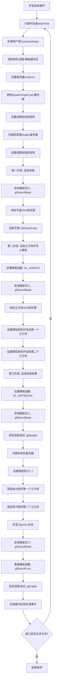

```mermaid
flowchart TD
    A[开始渲染循环] --> B[计算时间差deltaTime]
    B --> C[处理用户输入processInput]
    C --> D[清除颜色/深度/模板缓冲区]
  
    D --> E[设置着色器uniforms]
    E --> F[使用shaderSingleColor着色器]
    F --> G[设置视图和投影矩阵]
    G --> H[切换回普通shader着色器]
    H --> I[设置视图和投影矩阵]
  
    I --> J[第一阶段: 渲染地板]
    J --> K[禁用模板写入: glStencilMask]
    K --> L[绑定平面VAO和纹理]
    L --> M[渲染平面: glDrawArrays]
  
    M --> N[第二阶段: 渲染立方体并写入模板]
    N --> O[设置模板函数: GL_ALWAYS]
    O --> P[启用模板写入: glStencilMask]
    P --> Q[绑定立方体VAO和纹理]
    Q --> R[设置模型矩阵并渲染第一个立方体]
    R --> S[设置模型矩阵并渲染第二个立方体]
  
    S --> T[第三阶段: 渲染轮廓效果]
    T --> U[设置模板函数: GL_NOTEQUAL]
    U --> V[禁用模板写入: glStencilMask]
    V --> W[禁用深度测试: glDisable]
    W --> X[切换到单色着色器]
    X --> Y[设置缩放因子1.1]
    Y --> Z[渲染放大版的第一个立方体]
    Z --> AA[渲染放大版的第二个立方体]
  
    AA --> AB[恢复OpenGL状态]
    AB --> AC[启用模板写入: glStencilMask]
    AC --> AD[重置模板函数: glStencilFunc]
    AD --> AE[启用深度测试: glEnable]
  
    AE --> AF[交换缓冲区和处理事件]
    AF --> AG{窗口是否应该关闭?}
    AG -->|否| B
    AG -->|是| AH[结束程序]

```
